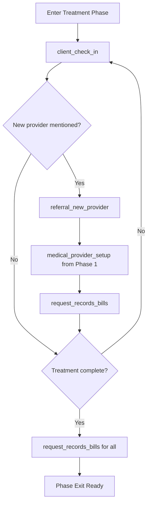

# Phase 2: Treatment

## Overview

**Phase ID:** `treatment`  
**Order:** 2  
**Track:** Pre-Litigation  
**State Machine Field:** `case_state.current_phase = "treatment"`

The Treatment phase monitors the client's medical care, ensures they receive appropriate treatment, and gathers documentation for subsequent phases. This phase continues until the client completes treatment (reaches Maximum Medical Improvement) or an early exit condition is triggered.

Treatment is unique because it can run **in parallel** with litigation phases if a suit is filed before treatment is complete.

---

## Entry Triggers

The case enters Treatment when:
- **`file_setup_complete`**: File Setup phase completed (retainer signed)
- **`returned_from_negotiation`**: Case returned from Negotiation for additional treatment

---

## Exit Criteria

### Hard Blockers

None - Treatment phase has no hard blockers.

### Soft Blockers

| Blocker ID | Description | Verification | Override Consequence |
|------------|-------------|--------------|---------------------|
| `treatment_complete` | Client reports done treating OR discharged from all providers | `check_treatment_complete()` | May settle before Maximum Medical Improvement |

### Early Exit Conditions

| Condition | Description | Allows Exit To | Required Action |
|-----------|-------------|----------------|-----------------|
| `low_limits_clear_liability` | Low policy limits + clear liability + significant injuries | `demand_in_progress` | Proceed with early demand |
| `sol_approaching` | Within 60 days of statute of limitations | `complaint` | Must file suit or decline representation |

---

## Workflows in This Phase

| Workflow ID | Name | Description | Workflow Path | Recurring |
|-------------|------|-------------|---------------|-----------|
| `client_check_in` | Client Check-In | Bi-weekly check-in with client during treatment | [workflows/client_check_in/](workflows/client_check_in/workflow.md) | Every 14 days |
| `medical_provider_status` | Medical Provider Status | Monitor treatment progress with providers | [workflows/medical_provider_status/](workflows/medical_provider_status/workflow.md) | As needed |
| `request_records_bills` | Request Records & Bills | Request medical records and bills from providers | [workflows/request_records_bills/](workflows/request_records_bills/workflow.md) | Per provider |
| `referral_new_provider` | Referral to New Provider | Refer client to specialist or additional provider | [workflows/referral_new_provider/](workflows/referral_new_provider/workflow.md) | As needed |
| `lien_identification` | Lien Identification | Identify and classify potential liens | [workflows/lien_identification/](workflows/lien_identification/workflow.md) | As needed |
| `medical_chronology` | Medical Chronology | Build and maintain treatment chronology | [workflows/medical_chronology/](workflows/medical_chronology/workflow.md) | Per record receipt |

### Workflow Folder Structure

Each workflow follows a self-contained folder structure:

```
workflows/{workflow_name}/
├── workflow.md              # Main workflow definition
├── skills/                  # Workflow-specific skills
│   └── {skill-name}/
│       ├── skill.md         # Lean skill definition
│       └── references/      # Detailed reference files
├── tools/                   # Required Python tools
│   ├── read_pdf.py          # PDF conversion (for workflows handling records)
│   └── generate_document.py # Template filling
└── templates/               # Document templates
```

**CRITICAL**: The agent cannot read PDFs directly. Workflows handling medical records include `read_pdf.py` in their `tools/` folder.

---

## Recurring Tasks

| Task | Frequency | Until |
|------|-----------|-------|
| Client check-in | Every 14 days | Demand sent |

---

## Workflow Dependencies



---

## Skills Required

| Skill | Location | Used By | Purpose |
|-------|----------|---------|---------|
| `calendar-scheduling` | `client_check_in/skills/` | client_check_in | Schedule bi-weekly check-ins |
| `medical-records-request` | `request_records_bills/skills/` | request_records_bills | Generate HIPAA-compliant record requests |
| `lien-classification` | `lien_identification/skills/` | lien_identification | Classify liens by type and governing law |
| `medical-chronology-generation` | `medical_chronology/skills/` | medical_chronology | Generate chronology from medical records |

### Tools Required

| Tool | Location | Purpose |
|------|----------|---------|
| `read_pdf.py` | `request_records_bills/tools/`, `medical_chronology/tools/` | **CRITICAL**: Convert PDFs to markdown (agent cannot read PDFs) |
| `generate_document.py` | `request_records_bills/tools/` | Fill document templates |
| `chronology_tools.py` | `medical_chronology/tools/` | Generate chronology PDFs |

---

## Lien Identification

During Treatment, liens should be identified as they arise:

| Lien Type | When to Identify | Action |
|-----------|------------------|--------|
| Health Insurance | At intake or when provider bills | Send LOR, request conditional amount |
| Medicare | If client is 65+ or disabled | Submit SSN for conditional payment letter |
| Medicaid | If client receives benefits | Contact DMS for lien amount |
| Hospital/Provider Liens | If provider files statutory lien | Acknowledge and track |

**Related Workflow:** `lien_identification` (can run in parallel)

---

## Common Blockers & Resolutions

| Blocker | Resolution |
|---------|------------|
| Client not returning calls | Try alternative contact methods. Document all attempts. Consider certified letter. |
| Provider won't release records | Verify HIPAA is signed. Send directly to provider. Follow up in 14 days. |
| Client seeing new providers without notification | Address during next check-in. Add providers to file. |
| Treatment stalling | Discuss with client. May need referral to specialist. |
| SOL approaching | CRITICAL: Evaluate for suit filing immediately. Set calendar alerts. |

---

## Client Contact Requirements

| Threshold | Status | Action |
|-----------|--------|--------|
| 0-30 days since last contact | OK | Normal check-in schedule |
| 31-60 days since last contact | Warning | Increase outreach frequency |
| 60+ days since last contact | Critical | Certified letter, consider withdrawal if no response |

---

## Next Phase

**→ `demand_in_progress`** (Demand) - Normal path when treatment completes

**→ `complaint`** (Litigation) - If SOL approaching or negotiation impossible

---

## Related Resources

- **Forms:** `forms/medical_records/`
- **Education:** `education/medical_records/`
- **Checklists:** `workflow_engine/checklists/treatment_checklist.md`
- **Central Templates:** `/templates/template_registry.json` (unified template manifest)
- **Central Tools:** `/Tools/tools_manifest.json` (tool discovery)

