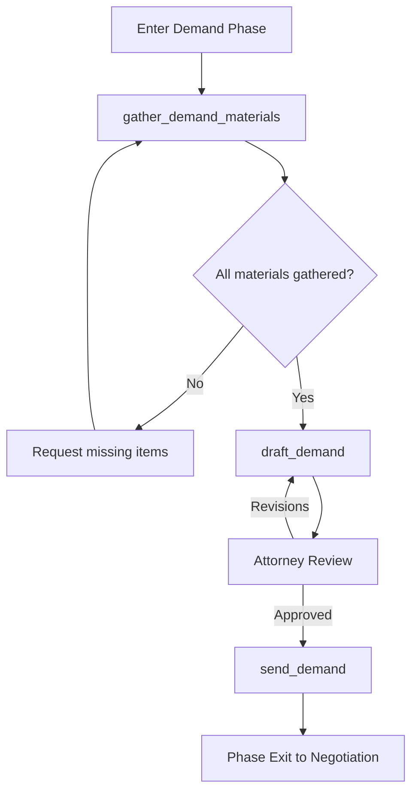

# Phase 3: Demand in Progress

## Overview

**Phase ID:** `demand_in_progress`  
**Order:** 3  
**Track:** Pre-Litigation  
**State Machine Field:** `case_state.current_phase = "demand_in_progress"`

The Demand phase is where the case value is assembled and presented to the insurance company. This involves gathering all remaining medical records and bills, finalizing the medical chronology, calculating special damages, identifying and documenting liens, drafting the demand letter, and sending it to the appropriate adjusters.

This is the most document-intensive phase and requires coordination of multiple data sources into a compelling demand package.

---

## Entry Triggers

The case enters Demand in Progress when:
- **`treatment_complete`**: Client has completed medical treatment
- **`early_demand_trigger`**: Early demand conditions met (low limits + clear liability)

---

## Exit Criteria

### Hard Blockers (MUST be completed)

| Blocker ID | Description | Verification |
|------------|-------------|--------------|
| `demand_sent` | Demand letter sent to all BI adjusters | `check_demand_sent_all_bi()` |

### Soft Blockers

| Blocker ID | Description | Verification | Override Consequence |
|------------|-------------|--------------|---------------------|
| `all_records_received` | Medical records received from all providers | `check_all_records_received()` | Demand may be incomplete |
| `all_bills_received` | Medical bills received from all providers | `check_all_bills_received()` | May undervalue case |
| `liens_identified` | All liens identified and conditional amounts requested | `check_liens_identified()` | May have surprise liens at settlement |

---

## Workflows in This Phase

| Workflow ID | Name | Description | Workflow Path |
|-------------|------|-------------|---------------|
| `gather_demand_materials` | Gather Demand Materials | Collect all materials needed for demand package | [workflows/gather_demand_materials/](workflows/gather_demand_materials/workflow.md) |
| `draft_demand` | Draft Demand | Draft the demand letter | [workflows/draft_demand/](workflows/draft_demand/workflow.md) |
| `send_demand` | Send Demand | Send demand to insurance adjuster(s) | [workflows/send_demand/](workflows/send_demand/workflow.md) |

### Workflow Folder Structure

Each workflow follows a self-contained folder structure:

```
workflows/{workflow_name}/
├── workflow.md              # Main workflow definition
├── skills/                  # Workflow-specific skills
│   └── {skill-name}/
│       ├── skill.md         # Lean skill definition
│       └── references/      # Detailed reference files
├── tools/                   # Required Python tools
│   ├── read_pdf.py          # PDF conversion (for medical records)
│   ├── generate_document.py # Template filling
│   └── chronology_tools.py  # Chronology generation
└── templates/               # Document templates
```

**CRITICAL**: The agent cannot read PDFs directly. Workflows handling medical records include `read_pdf.py` in their `tools/` folder.

---

## Workflow Dependencies



---

## Skills Required

| Skill | Location | Used By | Purpose |
|-------|----------|---------|---------|
| `damages-calculation` | `gather_demand_materials/skills/` | gather_demand_materials | Calculate special damages with CPT/ICD |
| `medical-chronology-generation` | `gather_demand_materials/skills/` | gather_demand_materials | Finalize medical chronology |
| `lien-classification` | `gather_demand_materials/skills/` | gather_demand_materials | Identify and classify liens |
| `demand-letter-generation` | `draft_demand/skills/` | draft_demand | AI-assisted demand drafting |
| `calendar-scheduling` | `send_demand/skills/` | send_demand | Set follow-up events |

### Tools Required

| Tool | Location | Purpose |
|------|----------|---------|
| `read_pdf.py` | `gather_demand_materials/tools/`, `draft_demand/tools/` | **CRITICAL**: Convert PDFs to markdown (agent cannot read PDFs) |
| `generate_document.py` | `gather_demand_materials/tools/`, `draft_demand/tools/` | Fill document templates |
| `chronology_tools.py` | `gather_demand_materials/tools/` | Generate chronology PDFs |

---

## Demand Package Components

| Component | Source | Required |
|-----------|--------|----------|
| Demand Letter | draft_demand workflow | ✅ Yes |
| Medical Records (all providers) | Records collection | ✅ Yes |
| Medical Bills (itemized) | Bills collection | ✅ Yes |
| Medical Chronology | medical-chronology skill | ✅ Yes |
| Accident/Police Report | File Setup phase | Recommended |
| Photos (vehicle, injuries, scene) | Client/intake | Recommended |
| Wage Loss Documentation | Client/employer | If applicable |
| Property Damage Documentation | Photos, estimates | If applicable |

---

## Special Damages Calculation

The demand should include detailed special damages:

| Category | Contents |
|----------|----------|
| Past Medical Expenses | Itemized bills by provider with CPT/ICD codes |
| Future Medical Expenses | If documented by physician |
| Lost Wages (Past) | Pay stubs, employer verification, off-work notes |
| Lost Wages (Future) | If documented disability |
| Property Damage | Repair estimates, total loss values |
| Out-of-Pocket Expenses | Mileage, prescriptions, medical supplies |

---

## Common Blockers & Resolutions

| Blocker | Resolution |
|---------|------------|
| Missing records from provider | Send follow-up request. Call records department. |
| Missing bills | Request itemized bills specifically. Check with billing department. |
| Lien amounts unknown | Send conditional amount request. Follow up in 14 days. |
| Attorney hasn't reviewed | Calendar the review. Provide summary of key points. |
| Adjuster information outdated | Call claims department to verify current adjuster. |

---

## Quality Checklist Before Sending

- [ ] All medical records received and reviewed
- [ ] All medical bills itemized and totaled
- [ ] Medical chronology complete and accurate
- [ ] Special damages calculated correctly
- [ ] Demand letter reviewed by attorney
- [ ] All exhibits compiled and organized
- [ ] Correct adjuster/recipient identified
- [ ] Demand amount appropriate for case value

---

## Next Phase

**→ `negotiation`** (Negotiation)

The case automatically advances to Negotiation phase when the demand is sent to all BI adjusters.

---

## Related Resources

- **Forms:** `forms/demand/`, `forms/medical_records/`
- **Education:** `education/negotiations/demand-letters/`
- **Checklists:** `workflow_engine/checklists/demand_checklist.md`
- **Templates:** `forms/demand_letter_template.docx`

