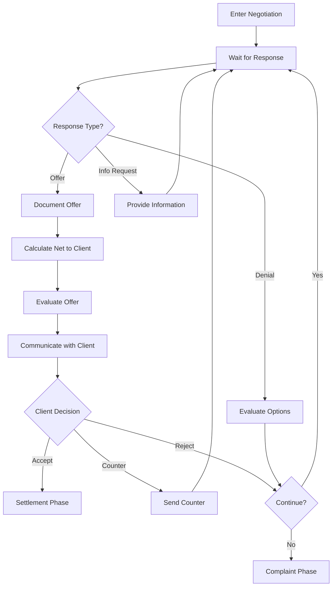

# Phase 4: Negotiation

## Overview

**Phase ID:** `negotiation`  
**Order:** 4  
**Track:** Pre-Litigation  
**State Machine Field:** `case_state.current_phase = "negotiation"`

The Negotiation phase is where the case is resolved through back-and-forth communication with the insurance adjuster or defense attorney. This phase tracks offers, counteroffers, client communications, and ultimately reaches either a settlement agreement or an impasse that leads to litigation.

This phase has no hard blockers - it exits based on completion conditions rather than requirements.

---

## Entry Triggers

The case enters Negotiation when:
- **`demand_sent`**: Demand letter has been sent to all BI adjusters

---

## Exit Criteria

### Hard Blockers

None - Negotiation has completion conditions instead of hard blockers.

### Soft Blockers

None

### Completion Conditions

| Condition | Description | Next Phase |
|-----------|-------------|------------|
| `settlement_reached` | Settlement agreement reached with insurance | `settlement` |
| `negotiation_failed` | Impasse reached - denied liability or fundamental disagreement | `complaint` or `treatment` |

---

## Workflows in This Phase

| Workflow ID | Name | Description | SOP Path |
|-------------|------|-------------|----------|
| `offer_evaluation` | Offer Evaluation | Evaluate offers and prepare recommendations | [workflows/offer_evaluation/workflow.md](workflows/offer_evaluation/workflow.md) |
| `negotiate_claim` | Negotiate Claim | Negotiate settlement with insurance | [workflows/negotiate_claim/workflow.md](workflows/negotiate_claim/workflow.md) |
| `track_offers` | Track Offers | Document and track all offers/counteroffers | [workflows/track_offers/workflow.md](workflows/track_offers/workflow.md) |

---

## Workflow Dependencies



---

## Skills Required

| Skill | Used By | Purpose |
|-------|---------|---------|
| `offer-evaluation` | offer_evaluation | Analyze offers, calculate net to client |
| `lien-negotiation` | offer_evaluation | Negotiate lien reductions |
| `negotiation-strategy` | negotiate_claim | Negotiation tactics and counter-offers |
| `calendar-scheduling` | negotiate_claim | Schedule follow-ups |
| `offer-tracking` | track_offers | Document and track offers |

Each workflow contains its own skills in the `skills/` subdirectory. Skills follow progressive disclosure with detailed information in `references/` subdirectories.

---

## Offer Evaluation Framework

When evaluating an offer, consider:

| Factor | Analysis |
|--------|----------|
| Offer vs. Policy Limits | What percentage of limits? |
| Offer vs. Medical Specials | Multiple of medical bills? |
| Liability Strength | How clear is liability? |
| Jury Appeal | How sympathetic is client? |
| Litigation Costs | What would litigation add in costs? |
| Time Value | How long until trial? |
| Lien Impact | What's the net after liens? |

---

## Net to Client Calculation

```
Gross Settlement:     $ ___________
- Attorney Fee:       $ ___________ (33⅓% pre-lit / 40% lit)
- Case Expenses:      $ ___________
- Liens:              $ ___________
= Net to Client:      $ ___________
```

---

## Follow-Up Schedule

| Event | Follow-Up Timing |
|-------|------------------|
| Demand sent | 1 week (confirm receipt) |
| Demand sent | 30 days (if no response) |
| Offer received | Client meeting within 3 days |
| Counter sent | 2 weeks |
| Information requested | 1 week after provided |

---

## Common Blockers & Resolutions

| Blocker | Resolution |
|---------|------------|
| No response from adjuster | Call and email. Document attempts. Escalate to supervisor. |
| Unreasonably low offer | Request explanation. Counter with documented support. |
| Client won't accept reasonable offer | Educate on risks. Document advice. Consider withdrawal. |
| Liability dispute | Consider liability expert. Evaluate for litigation. |
| Adjuster changed | Request new adjuster contact. Re-send demand if needed. |

---

## Client Communication Requirements

| Stage | Communication Required |
|-------|------------------------|
| Offer received | Contact within 48 hours to discuss |
| Counter sent | Notify client of response |
| Settlement accepted | Written authorization required |
| Impasse reached | Discuss litigation options |

---

## Next Phase

**→ `settlement`** (Settlement) - If settlement reached

**→ `complaint`** (Litigation) - If negotiation fails and client wants to proceed

**→ `treatment`** (Back) - If client needs more treatment before proceeding

---

## Related Resources

- **Forms:** `forms/settlement/`
- **Education:** `education/negotiations/`
- **Checklists:** `workflow_engine/checklists/negotiation_checklist.md`

