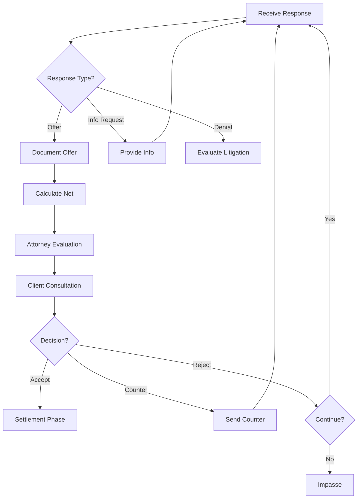

# Negotiate Claim Workflow

## Overview

This workflow manages the back-and-forth negotiation process with insurance companies. It tracks offers, calculates net amounts, facilitates attorney evaluation and client communication, and documents all negotiation activity.

**Workflow ID:** `negotiate_claim`  
**Phase:** `negotiation`  
**Owner:** Agent/User (mixed)  
**Repeatable:** Yes (multiple rounds)

---

## Prerequisites

- Demand sent
- Case in `negotiation` phase
- Adjuster contact information current

---

## Workflow Steps

### Step 1: Receive Response

**Step ID:** `receive_response`  
**Owner:** User  
**Automatable:** No  
**Waiting On:** External (insurance)

**Action:**
Receive and document insurance company's response to demand.

**Response Types:**

| Response | Description | Next Action |
|----------|-------------|-------------|
| Offer | Settlement offer made | Document and evaluate |
| Info request | Need more information | Provide requested info |
| Denial | Claim denied | Evaluate litigation |
| Acknowledgment | Demand received, under review | Wait for substantive response |

**Agent Prompt to User:**
> "Waiting for response from insurance. They may: make an offer, request more information, or deny the claim. Update when you hear back."

---

### Step 2: Document Offer

**Step ID:** `document_offer`  
**Owner:** Agent  
**Automatable:** Yes

**Action:**
Record offer details in case file.

**Collect:**
| Field | Description |
|-------|-------------|
| `date` | Date offer received |
| `amount` | Dollar amount offered |
| `conditions` | Any conditions attached |
| `adjuster_notes` | Adjuster's reasoning/comments |
| `response_deadline` | If time-limited |

**Agent Prompt:**
> "What was their offer? Any conditions or notes from the adjuster?"

**Updates to `insurance.json`:**
```json
{
  "claims[].offers": [
    {
      "date": "{{today}}",
      "amount": {{offer_amount}},
      "conditions": "{{conditions}}",
      "adjuster_notes": "{{notes}}",
      "status": "pending_evaluation"
    }
  ]
}
```

---

### Step 3: Calculate Net to Client

**Step ID:** `calculate_net`  
**Owner:** Agent  
**Automatable:** Yes

**Action:**
Calculate what the client would receive from this offer.

**Skill:** `Skills/document-xlsx/skill.md`

**Net Calculation:**
```
Gross Settlement:     $ {{offer_amount}}
- Attorney Fee:       $ {{offer_amount × fee_percentage}}
  (33⅓% pre-lit / 40% lit)
- Case Expenses:      $ {{total_expenses}}
- Liens:              $ {{total_liens}}
────────────────────────────────
= Net to Client:      $ {{net_amount}}
```

**Fee Percentage:**
- Pre-litigation: 33⅓% (0.3333)
- Litigation: 40% (0.40)

**Output:**
```json
{
  "settlement_calculation": {
    "gross": {{offer}},
    "attorney_fee": {{fee}},
    "fee_percentage": "{{rate}}",
    "expenses": {{expenses}},
    "liens": {{liens}},
    "net_to_client": {{net}}
  }
}
```

---

### Step 4: Evaluate Offer

**Step ID:** `evaluate_offer`  
**Owner:** User (Attorney)  
**Automatable:** No  
**Requires Attorney Decision:** Yes

**Action:**
Attorney analyzes offer against case value.

**Evaluation Factors:**

| Factor | Analysis |
|--------|----------|
| Offer vs. Limits | What % of policy limits? |
| Offer vs. Specials | Multiple of medical bills? |
| Liability Strength | How clear is liability? |
| Jury Appeal | How sympathetic is client? |
| Litigation Cost | What would litigation add? |
| Time Value | How long until trial? |
| Lien Impact | Net after liens? |

**Comparison Data:**
```
Demand Amount:        $ {{demand_amount}}
Offer Amount:         $ {{offer_amount}}
Policy Limits:        $ {{policy_limits}}
Total Specials:       $ {{total_specials}}
Offer as % of Limits: {{percentage}}%
Offer Multiple:       {{offer/specials}}x specials
```

**Agent Prompt to User:**
> "Offer is ${{offer_amount}}. Net to client would be ~${{net_to_client}}. Policy limits are ${{limits}}. Recommend: accept, counter, or reject?"

**Attorney Options:**
| Decision | Description |
|----------|-------------|
| Accept | Offer is acceptable |
| Counter | Make counter-offer at specific amount |
| Reject | Decline offer, continue negotiating |
| Impasse | Negotiation failed, consider litigation |

---

### Step 5: Communicate with Client

**Step ID:** `communicate_with_client`  
**Owner:** User  
**Automatable:** No

**Action:**
Discuss offer with client and get their input.

**Client Communication Should Include:**
- Offer amount received
- Net amount they would receive
- Attorney's recommendation
- Options (accept, counter, reject)
- Risks and benefits of each option

**Agent Prompt to User:**
> "Discuss the offer with client. Explain: offer amount, what they'd net after fees/liens, and your recommendation. Get their input."

**Document Client Response:**
```json
{
  "client_consultation": {
    "date": "{{today}}",
    "offer_discussed": {{amount}},
    "client_decision": "{{accept/counter/reject}}",
    "client_notes": "{{any_comments}}"
  }
}
```

---

### Step 6: Respond to Offer

**Step ID:** `respond_to_offer`  
**Owner:** User  
**Automatable:** No

**Action:**
Send response to insurance based on client instructions.

**Response Options:**

| Response | Action | Next Step |
|----------|--------|-----------|
| Accept | Confirm acceptance | → Settlement phase |
| Counter | State counter amount with reasoning | Wait for response |
| Reject | Decline, may continue or impasse | Evaluate next steps |

**Agent Prompt to User:**
> "Based on client input, please respond to the offer. If countering, what amount?"

**If Accepting:**
```json
{
  "claims[].settlement": {
    "accepted_date": "{{today}}",
    "amount": {{accepted_amount}},
    "next_step": "settlement_processing"
  }
}
```

**If Countering:**
```json
{
  "claims[].offers[].response": {
    "date": "{{today}}",
    "type": "counter",
    "amount": {{counter_amount}},
    "reasoning": "{{justification}}"
  }
}
```

---

## Negotiation Flow



---

## Outputs

### Data Updates
- Offers documented in insurance.json
- Net calculations saved
- Client consultation documented

### Phase Transitions
| Outcome | Next Phase |
|---------|------------|
| Settlement reached | `settlement` |
| Impasse | `complaint` or back to `treatment` |

---

## Completion Criteria

One of:
- `settlement_reached == true`
- `negotiation_failed_proceed_to_litigation`
- `negotiation_failed_return_to_treatment`

---

## State Updates

After each round, update `case_state.json`:
```json
{
  "negotiation": {
    "rounds": {{count}},
    "last_offer": {{amount}},
    "our_last_counter": {{amount}},
    "status": "{{active/settled/impasse}}"
  }
}
```

---

## Related Workflows

- **Triggered By:** Demand sent, phase entry
- **Triggers:** `settlement_processing` or `complaint`

---

## Skills Used

| Skill | Location | Purpose |
|-------|----------|---------|
| `negotiation-strategy` | `skills/negotiation-strategy/skill.md` | Strategy and tactics |
| `calendar-scheduling` | `skills/calendar-scheduling/skill.md` | Follow-up scheduling |

---

## Tools

| Tool | Location | Purpose |
|------|----------|---------|
| `generate_document.py` | `tools/generate_document.py` | Generate counter-offer letters |

---

## Templates

| Template | Location | Purpose |
|----------|----------|---------|
| Counter Offer Letter | `templates/counter_offer_letter.md` | Counter-offer communication |
| Settlement Summary | `templates/settlement_summary.md` | Settlement calculation breakdown |

---

## Troubleshooting

| Issue | Resolution |
|-------|------------|
| No response from adjuster | Follow up per schedule, escalate |
| Unreasonably low offer | Request explanation, counter with support |
| Client won't accept reasonable offer | Educate on risks, document advice |
| Liability dispute | Consider expert, evaluate litigation |
| Adjuster changed | Get new adjuster info, bring up to speed |

