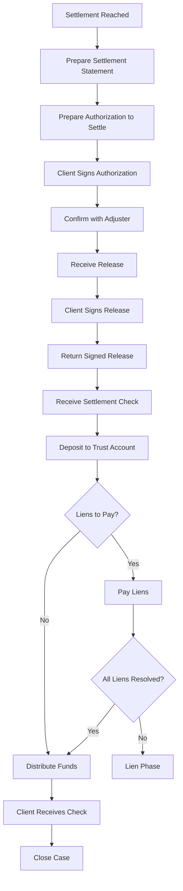

# Phase 5: Settlement

## Overview

**Phase ID:** `settlement`  
**Order:** 5  
**Track:** Pre-Litigation  
**State Machine Field:** `case_state.current_phase = "settlement"`

The Settlement phase handles the finalization and distribution of settlement funds. This includes preparing settlement documents, obtaining client authorization, processing the release, receiving and depositing the settlement check, paying liens, and distributing funds according to the settlement statement.

This phase has a critical hard blocker: the client must receive their funds before the case can close.

---

## Entry Triggers

The case enters Settlement when:
- **`settlement_reached`**: Settlement agreement reached during Negotiation

---

## Exit Criteria

### Hard Blockers (MUST be completed)

| Blocker ID | Description | Verification |
|------------|-------------|--------------|
| `client_received_funds` | Client has received their distribution | `check_client_paid()` |

### Soft Blockers

| Blocker ID | Description | Verification | Override Alternative |
|------------|-------------|--------------|---------------------|
| `all_liens_resolved` | All liens paid or negotiated | `check_liens_resolved()` | Move to `lien_phase` |

---

## Workflows in This Phase

| Workflow ID | Name | Description | SOP Path |
|-------------|------|-------------|----------|
| `lien_negotiation` | Lien Negotiation | Negotiate lien reductions to maximize client recovery | [workflows/lien_negotiation/workflow.md](workflows/lien_negotiation/workflow.md) |
| `settlement_processing` | Settlement Processing | Finalize settlement and distribute funds | [workflows/settlement_processing/workflow.md](workflows/settlement_processing/workflow.md) |

---

## Workflow Flow

---

## Skills Required

| Skill | Used By | Purpose |
|-------|---------|---------|
| `lien-resolution` | lien_negotiation | Negotiate lien reductions |
| `lien-classification` | lien_negotiation | Understand lien types |
| `settlement-statement` | settlement_processing | Create settlement breakdown |
| `docusign-send` | settlement_processing | Send documents for signature |

Each workflow contains its own skills in the `skills/` subdirectory. Skills follow progressive disclosure with detailed information in `references/` subdirectories.

---

## Settlement Statement Components

| Line Item | Calculation |
|-----------|-------------|
| Gross Settlement | Total settlement amount |
| - Attorney Fee | 33⅓% (pre-lit) or 40% (lit) of gross |
| - Case Expenses | Itemized reimbursable expenses |
| - Liens | Itemized lien payments |
| = Net to Client | Remainder after deductions |

---

## Document Checklist

| Document | Status Required | Signature Required |
|----------|-----------------|-------------------|
| Settlement Statement | Prepared | — |
| Authorization to Settle | Signed by client | ✅ Client |
| Insurance Release | Signed by client | ✅ Client |
| Settlement Check | Received and deposited | — |
| Lien Payments | Issued | — |
| Client Distribution Check | Issued | — |

---

## Timeline Expectations

| Step | Typical Duration |
|------|------------------|
| Settlement to Auth signed | 3-5 days |
| Auth to Release received | 5-10 days |
| Release signed and returned | 3-5 days |
| Release to Check received | 10-21 days |
| Check deposit to clear | 5-10 days |
| Distribution | 1-3 days after clear |

**Total typical duration:** 4-8 weeks

---

## Common Blockers & Resolutions

| Blocker | Resolution |
|---------|------------|
| Client won't sign auth | Review settlement statement. Address concerns. |
| Release has problematic language | Negotiate changes with adjuster. Have attorney review. |
| Check delayed | Follow up with claims department. Escalate if > 30 days. |
| Lien amount disputed | Negotiate with lien holder. May need Lien Phase. |
| Client wants funds immediately | Explain trust account requirements. Cannot release until check clears. |

---

## Trust Account Requirements

**Kentucky Rules of Professional Conduct require:**
- Settlement checks deposited to client trust account
- Funds held until check clears
- Liens paid before client distribution
- Detailed records maintained

---

## Lien Phase Trigger

If liens cannot be resolved before distribution:
- Pay undisputed amounts
- Hold disputed amounts in trust
- Move to Lien Phase for resolution
- Final distribution after lien resolution

---

## Next Phase

**→ `closed`** (Closed) - If all liens resolved and client paid

**→ `lien_phase`** (Lien Phase) - If liens outstanding after settlement

---

## Related Resources

- **Forms:** `forms/settlement/`
- **Education:** `education/settlement/`
- **Checklists:** `workflow_engine/checklists/settlement_checklist.md`
- **Templates:** `forms/settlement_statement_template.xlsx`, `forms/authorization_to_settle_template.docx`

