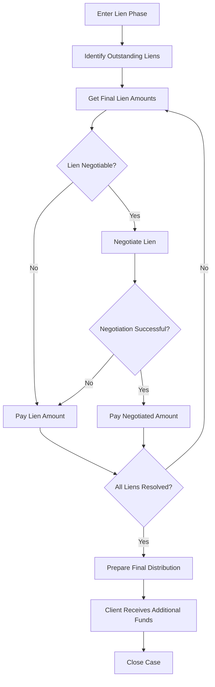

# Phase 6: Lien Phase

## Overview

**Phase ID:** `lien_phase`  
**Order:** 6  
**Track:** Pre-Litigation  
**State Machine Field:** `case_state.current_phase = "lien_phase"`

The Lien Phase handles difficult liens that couldn't be resolved during the Settlement phase. This typically involves Medicare liens, disputed health insurance subrogation, or complex lien negotiations. Funds are held in trust until liens are resolved, then a final distribution is made to the client.

This phase has two hard blockers: all liens must be resolved AND the final distribution must be completed.

---

## Entry Triggers

The case enters Lien Phase when:
- **`settlement_complete_liens_outstanding`**: Settlement complete but liens not fully resolved

---

## Exit Criteria

### Hard Blockers (MUST be completed)

| Blocker ID | Description | Verification |
|------------|-------------|--------------|
| `all_liens_resolved` | All liens resolved and paid | `check_all_liens_resolved()` |
| `final_distribution_complete` | Additional distribution to client completed | `check_final_distribution()` |

---

## Workflows in This Phase

| Workflow ID | Name | Description | SOP Path |
|-------------|------|-------------|----------|
| `get_final_lien` | Get Final Lien Amount | Obtain final lien amounts from all holders | [workflows/get_final_lien/workflow.md](workflows/get_final_lien/workflow.md) |
| `negotiate_lien` | Negotiate Lien | Negotiate lien reduction | [workflows/negotiate_lien/workflow.md](workflows/negotiate_lien/workflow.md) |
| `final_distribution` | Final Distribution | Distribute remaining funds to client | [workflows/final_distribution/workflow.md](workflows/final_distribution/workflow.md) |

---

## Workflow Flow

---

## Skills Required

| Skill | Used By | Purpose |
|-------|---------|---------|
| `liens` | get_final_lien, negotiate_lien | Lien identification and negotiation |
| `negotiations` | negotiate_lien | Negotiation strategies |
| `xlsx` | final_distribution | Calculate final distribution |

---

## Common Lien Types in This Phase

| Lien Type | Typical Issue | Resolution Strategy |
|-----------|---------------|---------------------|
| Medicare | Conditional payment letter pending | Request final demand letter |
| ERISA Health Plan | Full subrogation claimed | Review plan language for reduction |
| Medicaid | State recovery pending | Contact DMS for final amount |
| Hospital Lien | Statutory lien filed | Negotiate based on recovery |
| Workers' Comp | Subrogation claim | May require MSA consideration |

---

## Medicare Specific Process

Medicare liens require special handling:

1. **Conditional Payment Letter (CPL)** - Obtained during case
2. **Final Demand Letter** - Request after settlement
3. **Procurement Cost Reduction** - Automatic 1/3 reduction for attorney fees
4. **Hardship/Compromise** - Available if net to client is low
5. **Payment** - Must be paid within 60 days of final demand

**⚠️ Medicare has priority over client distribution by federal law.**

---

## ERISA Plan Negotiation

For employer health plans:

1. **Review Plan Language** - Check for reduction/common fund provisions
2. **Made Whole Doctrine** - May apply in some jurisdictions
3. **Common Fund** - Argue for proportional reduction
4. **Hardship** - Some plans allow discretionary reduction
5. **Document Everything** - ERISA fiduciary duties require documentation

---

## Timeline Expectations

| Step | Typical Duration |
|------|------------------|
| Request final lien amounts | 1-2 weeks |
| Medicare final demand | 30-60 days |
| Lien negotiation | 2-4 weeks |
| Payment processing | 1-2 weeks |
| Final distribution | 1 week |

**Total typical duration:** 6-12 weeks (Medicare can be longer)

---

## Common Blockers & Resolutions

| Blocker | Resolution |
|---------|------------|
| Medicare won't issue final demand | Submit final settlement information. Follow up weekly. |
| ERISA plan won't negotiate | Review plan documents. Consider legal challenge. |
| Lien amount exceeds settlement | Document hardship. Request compromise. May need attorney review. |
| Multiple competing liens | Prioritize by legal status. May need interpleader. |

---

## Trust Account Management

During Lien Phase:
- Disputed lien amounts held in trust
- Interest may accumulate (check rules)
- Document all holds and releases
- Prepare supplemental settlement statement for final distribution

---

## Next Phase

**→ `closed`** (Closed) - When all liens resolved and final distribution complete

---

## Related Resources

- **Forms:** `forms/liens/`
- **Education:** `education/liens/`
- **Checklists:** `workflow_engine/checklists/lien_checklist.md`

