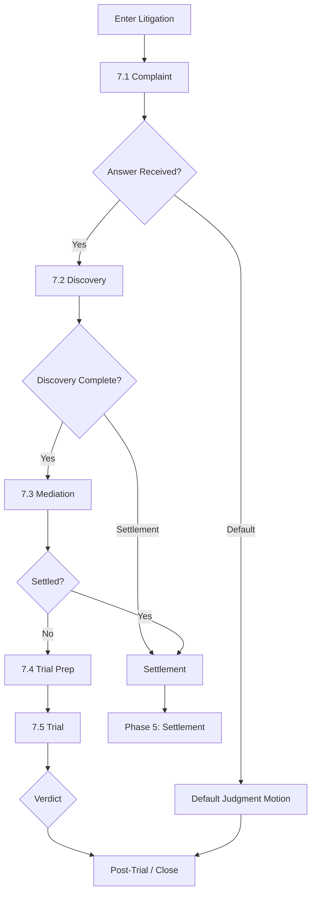

# Phase 7: Litigation

## Overview

**Phase ID:** `litigation`  
**Order:** 7  
**Track:** Litigation  
**State Machine Field:** `case_state.current_phase = "litigation"`

Litigation is the formal legal process phase, entered when pre-litigation settlement fails. This phase encompasses the entire civil lawsuit lifecycle from complaint filing through trial verdict.

Unlike pre-litigation phases (0-6), Litigation operates as a **parent phase with sub-phases** that track distinct stages of the lawsuit:

| Sub-Phase | Name | Description |
|-----------|------|-------------|
| 7.1 | Complaint | Draft, file, and serve the complaint; process defendant's answer |
| 7.2 | Discovery | Propound/respond to discovery; conduct depositions |
| 7.3 | Mediation | Prepare for and attend court-ordered mediation |
| 7.4 | Trial Prep | Manage experts; prepare trial materials and exhibits |
| 7.5 | Trial | Conduct trial proceedings |

---

## Entry Triggers

The case enters Litigation when:
- **`negotiation_failed`**: Demand exhausted without acceptable settlement
- **`statute_limitations`**: SOL approaching, must file to preserve claim
- **`client_decision`**: Client elects to proceed with litigation

---

## Exit Criteria

### Hard Blockers (MUST complete one)

| Exit Path | Condition | Next Phase |
|-----------|-----------|------------|
| Settlement | Settlement reached at any sub-phase | Phase 5 (Settlement) |
| Verdict | Trial completed with verdict | Phase 5 (Settlement) or Phase 8 (Closed) |
| Dismissal | Case dismissed (voluntary or involuntary) | Phase 8 (Closed) |

---

## Sub-Phase Navigation

```
phase_7_litigation/
├── README.md (this file)
├── landmarks.md
└── subphases/
    ├── 7.1_complaint/
    │   └── workflows/
    │       ├── draft_file_complaint/
    │       ├── serve_defendant/
    │       └── process_answer/
    ├── 7.2_discovery/
    │   └── workflows/
    │       ├── propound_discovery/
    │       ├── respond_to_discovery/
    │       ├── review_responses/
    │       ├── party_depositions/
    │       └── client_deposition_prep/
    ├── 7.3_mediation/
    │   └── workflows/
    │       ├── prepare_mediation/
    │       └── attend_mediation/
    ├── 7.4_trial_prep/
    │   └── workflows/
    │       ├── expert_management/
    │       └── trial_materials/
    └── 7.5_trial/
        └── workflows/
            └── conduct_trial/
```

---

## Litigation Flow



---

## Key Deadlines & Calendar

Litigation introduces strict court-imposed deadlines:

| Deadline Type | Typical Timing | Consequence |
|---------------|----------------|-------------|
| Answer | 20 days from service | Default judgment |
| Discovery cutoff | Set by scheduling order | Evidence excluded |
| Expert disclosure | 90 days before trial | Expert excluded |
| Mediation | Per court order | Sanctions |
| Pretrial conference | 2-4 weeks before trial | Required attendance |

**Critical**: All litigation deadlines must be calendared immediately upon receipt of scheduling order.

---

## Skills Required Across Litigation

| Skill | Sub-Phases | Purpose |
|-------|------------|---------|
| `complaint-drafting` | 7.1 | Draft and file complaints |
| `service-of-process` | 7.1 | Serve defendants properly |
| `discovery-drafting` | 7.2 | Propound interrogatories, RFPs, RFAs |
| `deposition-planning` | 7.2 | Plan and conduct depositions |
| `mediation-strategy` | 7.3 | Prepare for settlement conference |
| `expert-coordination` | 7.4 | Manage expert witnesses |
| `trial-presentation` | 7.5 | Present case at trial |

---

## Related Resources

- **Forms:** `forms/complaints/`, `forms/discovery/`, `forms/trial/`
- **Education:** `education/litigation/`, `education/depositions/`, `education/trial/`
- **Skills:** Individual sub-phase `skills/` directories

---

## Previous Phase

**← Phase 6: Lien** (if entering from failed negotiation after lien resolution)  
**← Phase 4: Negotiation** (if entering before settlement)

## Next Phase

**→ Phase 5: Settlement** (if settled during litigation)  
**→ Phase 8: Closed** (if verdict or dismissal)

