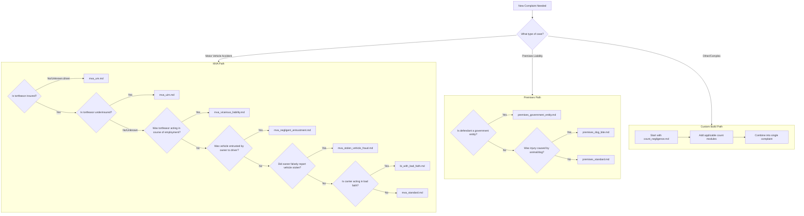

# Complaint Template Decision Tree

## Visual Flowchart

---

## Step-by-Step Decision Guide

### Step 1: Identify Case Type

**Question:** What type of incident caused the injury?

| Answer | Go To |
|--------|-------|
| Motor vehicle accident | Step 2A |
| Slip/fall or property condition | Step 2B |
| Dog bite or animal attack | Use `premises_dog_bite.md` |
| Other/Multiple theories | Step 3 |

---

### Step 2A: MVA Analysis

Answer these questions in order. Stop at the first "Yes":

#### Q1: Is the at-fault driver uninsured or unknown?
- **Yes** → Use `mva_um.md`
- **No/Unknown** → Continue to Q2

#### Q2: Is the at-fault driver underinsured relative to damages?
- **Yes** → Use `mva_uim.md`
- **No/Unknown** → Continue to Q3

#### Q3: Was the at-fault driver acting in the course of employment?
- **Yes** → Use `mva_vicarious_liability.md`
- **No** → Continue to Q4

#### Q4: Did the vehicle owner entrust the vehicle to the at-fault driver?
Consider this if:
- Owner is different from driver
- Owner knew or should have known driver was unfit
- Driver had history of reckless driving

- **Yes** → Use `mva_negligent_entrustment.md`
- **No** → Continue to Q5

#### Q5: Did the vehicle owner falsely report the vehicle stolen?
Consider this if:
- Owner reported vehicle stolen after accident
- Driver fled scene
- Evidence suggests owner knew driver

- **Yes** → Use `mva_stolen_vehicle_fraud.md`
- **No** → Continue to Q6

#### Q6: Is the at-fault driver's insurance carrier acting in bad faith?
Consider this if:
- Carrier denied clear liability
- Unreasonable delay in settlement
- Failure to make good faith settlement offer

- **Yes** → Use `bi_with_bad_faith.md`
- **No** → Use `mva_standard.md`

---

### Step 2B: Premises Liability Analysis

#### Q1: Is the defendant a government entity?
Examples:
- City/County government
- Metro Louisville
- State agency
- Public school

- **Yes** → Use `premises_government_entity.md`
- **No** → Continue to Q2

#### Q2: Was injury caused by an animal?
- **Yes** → Use `premises_dog_bite.md`
- **No** → Use `premises_standard.md`

---

### Step 3: Custom Complaint Building

When no single template fits, build a custom complaint:

#### 3.1 Start with Base Count
Always include: `count_negligence.md`

#### 3.2 Add Applicable Modules

| Situation | Add Module |
|-----------|------------|
| At-fault party is underinsured | `count_uim.md` |
| At-fault party is uninsured | `count_um.md` |
| Insurance carrier bad faith | `count_bad_faith.md` |
| Employer liability for employee | `count_vicarious_liability.md` |
| Owner entrusted vehicle | `count_negligent_entrustment.md` |
| At-fault driver is a minor | `count_parental_liability.md` |
| Fraud or concealment involved | `count_fraud.md` |

#### 3.3 Common Combinations

| Scenario | Modules to Combine |
|----------|-------------------|
| MVA + UIM + Bad Faith | Negligence + UIM + Bad Faith |
| MVA + Minor Driver + Parents | Negligence + Parental Liability |
| MVA + Employee + Employer Bad Faith | Negligence + Vicarious + Bad Faith |
| Premises + Government + Specific Employees | Negligence (with ministerial duty allegations) |

---

## Quick Reference Matrix

### By Defendant Type

| Defendant Type | Primary Template | Alternative |
|----------------|------------------|-------------|
| Individual driver | `mva_standard.md` | Add UIM/UM if applicable |
| Commercial driver | `mva_vicarious_liability.md` | - |
| Vehicle owner (not driver) | `mva_negligent_entrustment.md` | - |
| Insurance company | `bi_with_bad_faith.md` | - |
| Property owner | `premises_standard.md` | - |
| Government entity | `premises_government_entity.md` | - |
| Animal owner | `premises_dog_bite.md` | - |
| Minor defendant | Custom: Negligence + Parental | - |

### By Insurance Situation

| Insurance Status | Template/Module |
|------------------|-----------------|
| Fully insured, no issues | `mva_standard.md` |
| Underinsured | `mva_uim.md` or add `count_uim.md` |
| Uninsured | `mva_um.md` or add `count_um.md` |
| Carrier bad faith | `bi_with_bad_faith.md` or add `count_bad_faith.md` |
| UIM + Bad faith | `bi_bad_faith_uim.md` |

---

## Special Considerations

### Multiple Defendants
When suing multiple defendants with different theories:
1. Name all defendants in caption
2. Include jurisdictional facts for each
3. Organize counts by defendant or by theory
4. Specify which defendants each count applies to

### Amended Complaints
When adding claims after initial filing:
1. Reference original complaint allegations
2. Add new factual allegations
3. Add new counts
4. File Motion for Leave to Amend with proposed Amended Complaint

### Government Defendants
Special requirements:
1. KRS 411.110 notice requirement (sidewalk defects)
2. Name specific employees in ministerial capacity
3. Identify specific ministerial duties breached
4. Consider sovereign immunity limitations

### Minor Defendants
Under KRS 186.590:
1. Name minor as defendant
2. Name parent(s)/guardian(s) as defendants
3. Include parental liability count
4. Consider negligent entrustment if applicable

