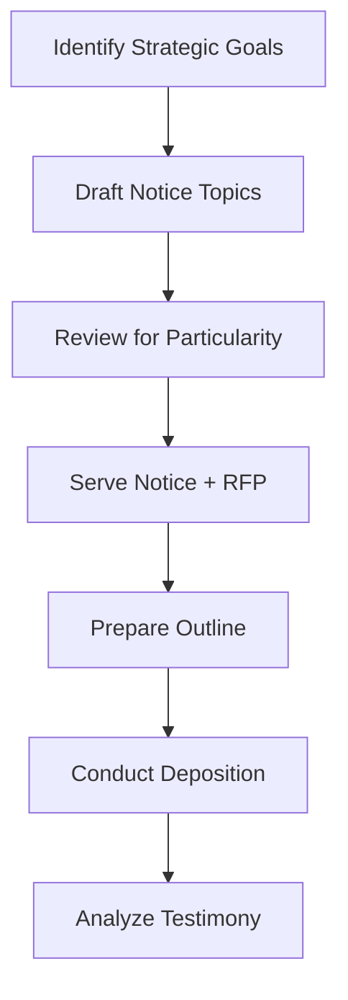

# Corporate Representative Deposition Skill

## Overview

Draft CR 30.02(6) deposition notices with properly formulated topics and prepare examination materials for corporate representative depositions.

## When to Use

Use when:
- Need to depose corporate defendant
- Need to bind corporation to facts
- Verifying discovery compliance
- Mapping document locations
- Establishing corporate policies/rules

DO NOT use for:
- Individual party depositions (use `rules-based-examination`)
- Expert depositions (use `expert-deposition`)
- Defending client depositions (use `deposition-defense`)

## Strategic Goals

First, identify the strategic goal(s):

| Goal | Use When |
|------|----------|
| Discovery Mapping | Need to find documents and witnesses |
| Compliance Verification | Discovery responses seem incomplete |
| Document Explanation | Complex documents need context |
| Liability Pin-Down | Need to bind corporation to facts |
| ESI Mapping | Electronic data may be relevant |
| Foundational Rules | Want corporation to endorse standards |

**See:** `references/corp_rep/strategic_goals.md`

## Workflow



## Phase 1: Notice Drafting

### Topic Formulation

Each topic must meet "reasonable particularity":
1. Corporation can identify **scope**
2. Corporation can **select** appropriate witness
3. Corporation can adequately **prepare** witness

### Topic Template

```
"[Corporation's] [subject matter] regarding/relating to [specific topic] 
during [time period], including [specific sub-elements]."
```

### Avoid These Pitfalls

- ❌ "All information about X" (too vague)
- ❌ Topics without date ranges (overbroad)
- ❌ Asking for legal conclusions
- ❌ Seeking privileged information

**See:** `references/corp_rep/topic_drafting.md`

### Use Notice Template

Copy and customize: `templates/notices/notice_corp_rep.md`

For insurance carriers:
- PIP: `templates/notices/notice_corp_rep_pip.md`
- UIM: `templates/notices/notice_corp_rep_uim.md`

## Phase 2: Coordinated Discovery

### 60-Day Rule

Serve RFP at least 60 days before deposition:
- 30-day response period
- 30-day buffer for motion to compel

### Align RFP with Topics

Each notice topic should have corresponding RFP request.

## Phase 3: Deposition Preparation

### Opening Confirmations

On record, establish:
```
Q. You are designated by [Corporation] to testify on its behalf?
Q. You understand your testimony binds the corporation?
Q. You are prepared to testify on each noticed topic?
```

### Topic Confirmation

For each topic:
```
Q. Are you prepared to testify on behalf of [Corporation] regarding [Topic X]?
```

### Outline Structure

Use template: `templates/outlines/outline_corp_rep.md`

## Handling Know-Nothing Witnesses

When witness cannot answer on a noticed topic:

### Build the Record

```
Q. You were designated to testify about [topic]?
Q. You cannot answer questions about [topic]?
Q. Did [Corporation] make any effort to prepare you?
Q. Is there anyone at [Corporation] who has knowledge?
Q. So [Corporation's] position is it simply doesn't know?
```

### Strategic Value

Know-nothing witness = strategic opportunity:
- Documents corporate failure to comply
- Supports motion to compel
- Demonstrates indifference at trial

**See:** `references/corp_rep/know_nothing.md`

## Outputs

### Pre-Deposition
- CR 30.02(6) deposition notice with topics
- Coordinated RFP
- Topic-by-topic justification memo

### Post-Deposition
- Topic coverage tracking
- Key corporate admissions
- Know-nothing documentation
- Motion to compel (if needed)

## Document Generation

```bash
# Copy notice template
cp "/path/to/deposition_library/templates/notices/notice_corp_rep.md" \
   "/{project}/Litigation/Discovery/Corp_Rep_Notice.md"

# Agent fills topics
# Generate DOCX/PDF
python ${ROSCOE_ROOT}/Tools/document_generation/generate_document.py \
    "/{project}/Litigation/Discovery/Corp_Rep_Notice.md"
```

## Sample Topics

**See:** `references/corp_rep/sample_topics.md` for case-specific examples.

## Quality Checklist

- [ ] Strategic goal(s) identified
- [ ] Topics meet "reasonable particularity"
- [ ] Date ranges specified where appropriate
- [ ] No legal conclusions requested
- [ ] Aligned RFP prepared
- [ ] RFP served 60+ days before deposition
- [ ] Opening confirmation questions ready

## References

- `references/corp_rep/strategic_goals.md`
- `references/corp_rep/topic_drafting.md`
- `references/corp_rep/know_nothing.md`
- `references/corp_rep/sample_topics.md`

## Related Skills

- `rules-based-examination` - For individual party depositions
- `expert-deposition` - For defense expert depositions
- `deposition-defense` - For defending client depositions

