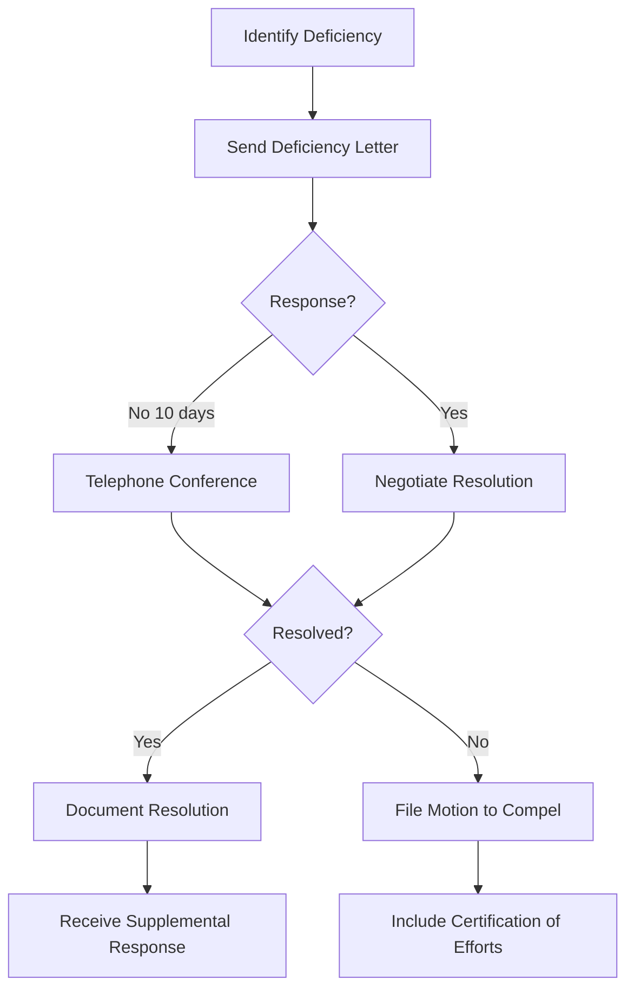

# Meet and Confer Guide

## Purpose

Before filing any discovery motion under CR 37, counsel must certify that they have in good faith conferred or attempted to confer with opposing counsel to resolve the dispute. This guide provides templates and strategies for effective meet-and-confer communications.

---

## CR 37.01 Requirement

> "(1) ... The motion must include a certification that the movant has in good faith conferred or attempted to confer with the person or party failing to make disclosure or discovery in an effort to obtain it without court action."

**Key Points:**
- Good faith effort required
- Must actually attempt to resolve
- Certification required in motion
- Courts take requirement seriously

---

## Meet and Confer Process



---

## Step 1: Initial Deficiency Letter

### Letter Template

```
[Firm Letterhead]

[Date]

VIA EMAIL AND U.S. MAIL

[Defense Counsel Name]
[Firm Name]
[Address]

Re: [Case Name]
    Case No. [Number]
    Discovery Deficiencies

Dear [Counsel]:

I write regarding deficiencies in [Defendant's] responses to [Plaintiff's] 
[First Set of Interrogatories / Requests for Production / Requests for Admission] 
served on [date]. As detailed below, several responses are incomplete or 
otherwise deficient, requiring supplementation.

**INTERROGATORY NO. [X]:** [Brief description of deficiency]
This response is deficient because [explanation]. A complete response would 
include [what is needed].

**REQUEST NO. [X]:** [Brief description of deficiency]
[Explanation of deficiency and what is needed]

[Continue for each deficient response]

Please provide supplemental responses addressing these deficiencies within 
ten (10) days of this letter. If you believe any response is adequate as 
provided, or if there is a legitimate basis for withholding information, 
please contact me to discuss.

Should we be unable to resolve these issues informally, we will have no 
choice but to seek court intervention pursuant to CR 37.

I am available to discuss these matters at your convenience. Please contact 
me at [phone] or [email].

Sincerely,

[Attorney Name]
```

---

## Step 2: Telephone Conference

If written response is inadequate or no response received:

### Preparation Checklist

- [ ] Have deficiency letter in front of you
- [ ] Note specific responses at issue
- [ ] Know what you will accept as resolution
- [ ] Be prepared to explain why responses are deficient
- [ ] Have calendar ready for supplemental response deadline
- [ ] Take notes during call

### Discussion Points

1. **Identify issues:** Walk through each deficient response
2. **Explain deficiency:** Specific reasons response is inadequate
3. **Propose resolution:** What supplemental response would cure
4. **Set deadline:** Reasonable time for supplementation (typically 10-14 days)
5. **Document agreement:** Confirm understanding in writing

### Conference Notes Template

```
Meet and Confer Telephone Conference
[Case Name] - Case No. [Number]
Date: [Date] Time: [Time]
Participants: [Names]

Issues Discussed:
1. [Issue] - [Outcome]
2. [Issue] - [Outcome]

Agreements Reached:
- [Agreement 1]
- [Agreement 2]

Deadline for Supplemental Responses: [Date]

Follow-Up Required:
- [ ] [Task]
- [ ] [Task]

Notes: [Additional notes]
```

---

## Step 3: Confirmation Letter

After telephone conference:

```
[Date]

[Defense Counsel]

Re: [Case Name] - Confirmation of Meet and Confer

Dear [Counsel]:

This confirms our telephone conference of [date] regarding discovery 
deficiencies in this matter. As we discussed:

1. [Defendant] will provide supplemental responses to Interrogatory Nos. 
   [X, Y, Z] by [date].

2. [Defendant] will produce the documents identified in RFP No. [X] by [date].

3. [Defendant] maintains its objection to RFA No. [X]. We disagree with 
   this position and reserve our right to seek court intervention.

Please advise if this does not accurately reflect our discussion.

Sincerely,

[Attorney Name]
```

---

## Step 4: If Unresolved - Motion Certification

### Certification Language

```
CERTIFICATION PURSUANT TO CR 37.01

Undersigned counsel certifies that counsel has in good faith conferred 
with counsel for [Defendant] in an effort to obtain the discovery sought 
without court action. Specifically:

1. On [date], counsel sent a detailed letter identifying deficiencies in 
   [Defendant's] discovery responses. (Exhibit A)

2. On [date], counsel and [defense counsel] participated in a telephone 
   conference to discuss the deficiencies.

3. During the conference, [describe efforts to resolve and what issues 
   remain unresolved].

4. Despite these efforts, [Defendant] has failed to provide adequate 
   responses to the following discovery requests: [list].

Counsel certifies that this motion is filed only after good faith efforts 
to resolve the dispute have been unsuccessful.

[Attorney signature]
```

---

## Best Practices

### Do:
- Be specific about deficiencies
- Propose concrete solutions
- Set reasonable deadlines
- Document all communications
- Follow up in writing
- Be professional and courteous
- Give opposing counsel chance to cure

### Don't:
- Make vague complaints
- Issue ultimatums immediately
- Refuse to discuss
- Let deadlines pass without action
- Fail to document efforts
- Be unprofessional
- File motion without good faith attempt

---

## Common Resolutions

| Issue | Common Resolution |
|-------|-------------------|
| Incomplete interrogatory answer | Supplemental response with additional detail |
| Missing documents | Production within agreed timeframe |
| Privilege without log | Privilege log provided |
| Overbroad objection | Agreement on limited scope |
| Improper denial | Amended response |

---

## Escalation Timeline

| Day | Action |
|-----|--------|
| 0 | Receive deficient responses |
| 1-3 | Review and identify deficiencies |
| 5 | Send deficiency letter |
| 15 | If no response, telephone call |
| 17 | Send confirmation letter |
| 25-30 | If not cured, file motion |

---

## Related Resources

- [Response Deficiency Checklist](response_deficiency_checklist.md)
- [Motion to Compel Outline](motion_to_compel_outline.md)
- CR 37 - Failure to Make Discovery

