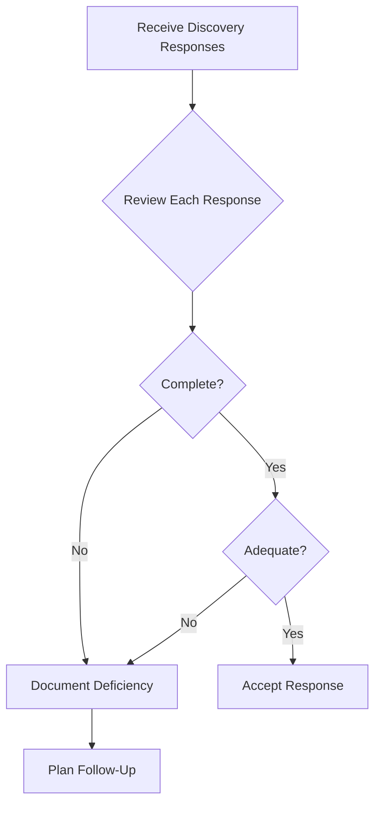

# Discovery Response Deficiency Checklist

## Purpose

Use this checklist to systematically review discovery responses for deficiencies that warrant follow-up, meet-and-confer, or motion practice. Based on Kentucky Civil Rules and strategic discovery principles.

---

## Response Review Process

---

## Interrogatory Response Deficiencies

### Completeness Issues

| Deficiency | Example | Required Response |
|------------|---------|-------------------|
| **No answer** | Objection only, no response | Must respond subject to objection |
| **Partial answer** | Only answers part of question | Must address all parts |
| **Evasive answer** | Doesn't actually answer | Treated as failure to answer |
| **"See documents"** | "See attached documents" | Must answer in narrative form |
| **Boilerplate** | Copy/paste for all questions | Must be case-specific |

### Checklist - Interrogatories

- [ ] **Verification:** Is response verified under oath by party (not attorney)?
- [ ] **Timeliness:** Served within 30 days (or 45 if with complaint)?
- [ ] **All questions answered:** Response to each interrogatory?
- [ ] **Complete answers:** Each question fully addressed?
- [ ] **Specific answers:** Not evasive or vague?
- [ ] **Proper objections:** Specific grounds stated for each objection?
- [ ] **Response despite objection:** Information provided subject to objection?
- [ ] **Witness identification:** Names, addresses, relationship provided?
- [ ] **Expert disclosure:** Complete per CR 26.02?
- [ ] **Document identification:** Referenced documents identified?

---

## RFP Response Deficiencies

### Production Issues

| Deficiency | Example | Required Response |
|------------|---------|-------------------|
| **No response** | Fails to state will produce, object, or none exist | Must state one of three |
| **Incomplete production** | Produces some but not all responsive documents | Must produce all or explain |
| **Unorganized production** | Document dump without organization | Must organize by request or as kept |
| **Missing documents** | Key documents conspicuously absent | Follow up specifically |
| **Redactions without explanation** | Blacked out portions | Must explain basis |
| **Privilege without log** | Claims privilege, no log | Must provide privilege log |

### Checklist - RFPs

- [ ] **Timeliness:** Served within 30 days?
- [ ] **Response to each request:** Statement for each RFP?
- [ ] **Proper statement:** "Will produce," "Objection," or "None exist"?
- [ ] **Documents actually produced:** Not just stated "will produce"?
- [ ] **Organization:** By request category or as maintained?
- [ ] **Privilege log:** For all documents withheld on privilege?
- [ ] **Complete production:** All categories addressed?
- [ ] **Legible copies:** Readable documents?
- [ ] **Native format (ESI):** Electronic documents in usable format?
- [ ] **Metadata preserved (ESI):** Not just printouts of electronic docs?

---

## RFA Response Deficiencies

### Admission Issues

| Deficiency | Example | Required Response |
|------------|---------|-------------------|
| **No response** | Fails to respond within 30 days | Deemed admitted |
| **Qualified denial** | "Denies as stated" without explanation | Must explain qualification |
| **Improper lack of info** | Claims lack of knowledge for facts in control | Must make reasonable inquiry |
| **Evasive response** | Neither admits nor denies | Must commit to position |

### Checklist - RFAs

- [ ] **Timeliness:** Response within 30 days (or deemed admitted)?
- [ ] **Response to each request:** Admit, deny, or lack of info for each?
- [ ] **Clear response:** Unambiguous admission or denial?
- [ ] **Qualified responses explained:** If qualified, reasons stated?
- [ ] **Reasonable inquiry:** For "lack of info," inquiry made?
- [ ] **Partial admissions:** If partly true, portion admitted?

---

## Cross-Referencing Issues

### Consistency Check

Compare discovery responses against:
- [ ] **Pleadings:** Consistent with complaint/answer?
- [ ] **Other discovery:** Consistent across interrogatories, RFAs, depositions?
- [ ] **Public records:** Consistent with police reports, court records?
- [ ] **Prior statements:** Consistent with insurance statements, interviews?

### Red Flags

| Inconsistency | Example | Action |
|---------------|---------|--------|
| Denial vs. admission elsewhere | Denies in answer, admits in interrogatories | Document for impeachment |
| Different facts | Interrogatory says X, deposition says Y | Targeted follow-up |
| Missing information | Key facts not disclosed | Specific request |
| Changed story | Timeline inconsistent | Deposition questioning |

---

## Objection Analysis

### Valid vs. Invalid Objections

| Objection | Valid If... | Invalid If... |
|-----------|------------|---------------|
| **Privilege** | Genuinely privileged, log provided | No log, broad assertion |
| **Overbroad** | Truly excessive scope | Reasonable request |
| **Burdensome** | Genuine burden demonstrated | Mere inconvenience |
| **Irrelevant** | Clearly no relevance | May lead to admissible evidence |
| **Vague** | Genuinely unclear | Normal legal terminology |

### Checklist - Objections

- [ ] **Specific grounds:** Objection states specific basis?
- [ ] **Good faith:** Objection appears warranted?
- [ ] **Privilege log:** If privilege asserted, log provided?
- [ ] **Response anyway:** Information provided subject to objection?
- [ ] **Not boilerplate:** Not same objection to every request?

---

## Deficiency Summary Template

| Request # | Type | Deficiency | Severity | Follow-Up |
|-----------|------|------------|----------|-----------|
| Int. 5 | Interrogatory | Incomplete - didn't list all witnesses | High | Meet & confer |
| RFP 3 | Production | No privilege log for withheld docs | High | Letter demanding log |
| RFA 12 | Admission | Improper "lack of info" | Medium | Follow-up RFA |
| Int. 15 | Interrogatory | Evasive - didn't actually answer | Medium | Deposition follow-up |

---

## Severity Ratings

| Rating | Description | Action |
|--------|-------------|--------|
| **High** | Significant deficiency affecting case | Immediate follow-up |
| **Medium** | Material deficiency | Include in meet & confer |
| **Low** | Minor deficiency | Note for possible follow-up |

---

## Next Steps by Severity

### High Priority Deficiencies
1. Send deficiency letter within 5 business days
2. Request cure within 10 days
3. If not cured, prepare motion to compel
4. Request sanctions if warranted

### Medium Priority Deficiencies
1. Compile for meet and confer
2. Address in supplemental discovery
3. Follow up in deposition
4. Document for potential motion

### Low Priority Deficiencies
1. Note in case file
2. Address if pattern develops
3. Consider for trial strategy
4. May not warrant formal challenge

---

## Related Resources

- [Defense Answer Review](defense_answer_review.md)
- [Meet and Confer Guide](meet_and_confer_guide.md)
- [Motion to Compel Outline](motion_to_compel_outline.md)

