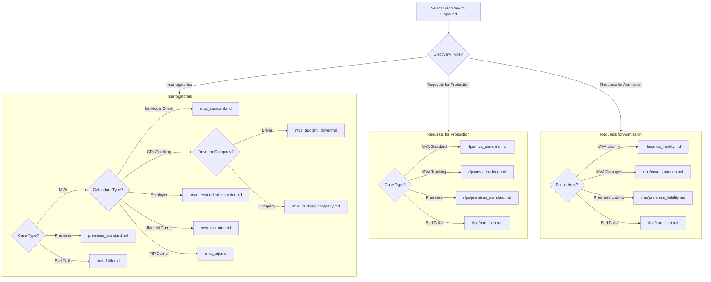

# Discovery Template Selection - Decision Tree

## Visual Flowchart



---

## Step-by-Step Decision Guide

### Step 1: Identify Discovery Type

| Type | Purpose | Kentucky Rule |
|------|---------|---------------|
| **Interrogatories** | Written questions requiring sworn answers | CR 33 |
| **Requests for Production (RFPs)** | Demand documents, photos, electronic data | CR 34 |
| **Requests for Admission (RFAs)** | Force admission or denial of specific facts | CR 36 |

**Typical Discovery Package:**
- Interrogatories + RFPs together (most common)
- RFAs separately (strategic timing for trial prep)

---

### Step 2: Select Interrogatory Template

#### For Motor Vehicle Accident Cases

**Question 1:** Who is the defendant?

| Defendant Type | Template | When to Use |
|---------------|----------|-------------|
| Individual driver | `mva_standard.md` | Standard at-fault driver |
| CDL/Commercial driver | `mva_trucking_driver.md` | Truck, bus, commercial vehicle |
| Trucking company | `mva_trucking_company.md` | Motor carrier, employer |
| Employer (non-trucking) | `mva_respondeat_superior.md` | Employee driving for work |
| UM/UIM insurance carrier | `mva_um_uim.md` | Client's own insurer for UM/UIM |
| PIP insurance carrier | `mva_pip.md` | PIP benefits dispute |

**Question 2:** Any special circumstances?

| Circumstance | Add Module |
|--------------|------------|
| Cell phone/distraction suspected | `mod_cell_phone.md` |
| Employer relationship unclear | `mod_employment_scope.md` |
| Need expert disclosure | `mod_expert_disclosure.md` |

#### For Premises Liability Cases

| Defendant Type | Template |
|---------------|----------|
| Property owner/business | `premises_standard.md` |

**Commonly Added Modules:**
- `mod_prior_incidents.md` - Substantially similar prior incidents
- `mod_expert_disclosure.md` - Expert on safety standards

#### For Bad Faith Cases

| Defendant Type | Template |
|---------------|----------|
| Insurance carrier | `bad_faith.md` |

Focus areas:
- Claims handling practices
- UCSPA (KRS 304.12-230) violations
- Internal guidelines and training
- Reserve history and valuation

---

### Step 3: Select RFP Template

| Case Type | Template | Key Documents |
|-----------|----------|---------------|
| MVA Standard | `mva_standard.md` | Photos, statements, policies, cell records |
| MVA Trucking | `mva_trucking.md` | DQ files, logs, maintenance, GPS, ELD data |
| Premises | `premises_standard.md` | Incident reports, surveillance, maintenance logs |
| Bad Faith | `bad_faith.md` | Claim file, adjuster notes, guidelines, reserves |

---

### Step 4: Select RFA Template

**Strategic Timing:** RFAs are most effective:
- After depositions (lock in testimony)
- Before summary judgment (establish undisputed facts)
- For cost-of-proof (CR 36.02) sanctions

| Focus Area | Template | Purpose |
|------------|----------|---------|
| MVA Liability | `mva_liability.md` | Admit negligence elements |
| MVA Damages | `mva_damages.md` | Admit injury causation, medical necessity |
| Premises Liability | `premises_liability.md` | Admit notice, control, dangerous condition |
| Bad Faith | `bad_faith.md` | Admit UCSPA requirements, investigation failures |

---

## Template Selection Matrix

### By Defendant Type

| Defendant | Interrogatory | RFP | RFA |
|-----------|--------------|-----|-----|
| Individual driver | mva_standard | mva_standard | mva_liability + mva_damages |
| CDL driver | mva_trucking_driver | mva_trucking | mva_liability |
| Trucking company | mva_trucking_company | mva_trucking | mva_liability |
| Employer | mva_respondeat_superior | mva_standard | mva_liability |
| UM/UIM carrier | mva_um_uim | bad_faith | bad_faith |
| PIP carrier | mva_pip | bad_faith | bad_faith |
| Property owner | premises_standard | premises_standard | premises_liability |
| Bad faith carrier | bad_faith | bad_faith | bad_faith |

### By Case Phase

| Phase | Focus | Recommended Approach |
|-------|-------|---------------------|
| Early Discovery | Facts, witnesses, insurance | Full interrogatories + RFPs |
| Post-Deposition | Lock in testimony | Targeted RFAs |
| Pre-MSJ | Establish undisputed facts | Comprehensive RFAs |
| Expert Disclosure | Expert opinions | Add mod_expert_disclosure |

---

## Modular Question Sets Reference

### When to Add Each Module

| Module | Add When... |
|--------|------------|
| `mod_witness_identification.md` | Need comprehensive witness list (usually included in base) |
| `mod_insurance_coverage.md` | Coverage disputes, policy limits unknown |
| `mod_expert_disclosure.md` | Anticipate expert testimony on either side |
| `mod_prior_incidents.md` | Pattern evidence relevant (premises, products) |
| `mod_cell_phone.md` | Distraction suspected, need phone records |
| `mod_employment_scope.md` | Vicarious liability, scope of employment disputed |

### Module Combination Examples

**Example 1: Trucking Case with CDL Driver**
```
Base: mva_trucking_driver.md
+ mod_cell_phone.md (distraction)
+ mod_expert_disclosure.md (accident reconstruction)
```

**Example 2: Premises Case with Prior Incidents**
```
Base: premises_standard.md
+ mod_prior_incidents.md (similar falls)
+ mod_expert_disclosure.md (safety expert)
```

**Example 3: Bad Faith UIM Case**
```
Base: bad_faith.md
+ mod_expert_disclosure.md (claims handling expert)
```

---

## Kentucky-Specific Considerations

### Interrogatory Limits (CR 33.01)
- **Standard limit:** 30 interrogatories (including subparts)
- **Subpart counting:** Each subpart counts as one interrogatory
- **Exceeding limit:** Must seek leave of court

### Three "Free" Questions (CR 33.01(3))
These do NOT count toward the 30-question limit:
1. Identity of person answering
2. Willingness to supplement
3. Names/addresses of witnesses

### Response Deadlines
| Situation | Deadline |
|-----------|----------|
| Served after answer filed | 30 days |
| Served with complaint | 45 days |
| Extensions | By agreement or court order |

