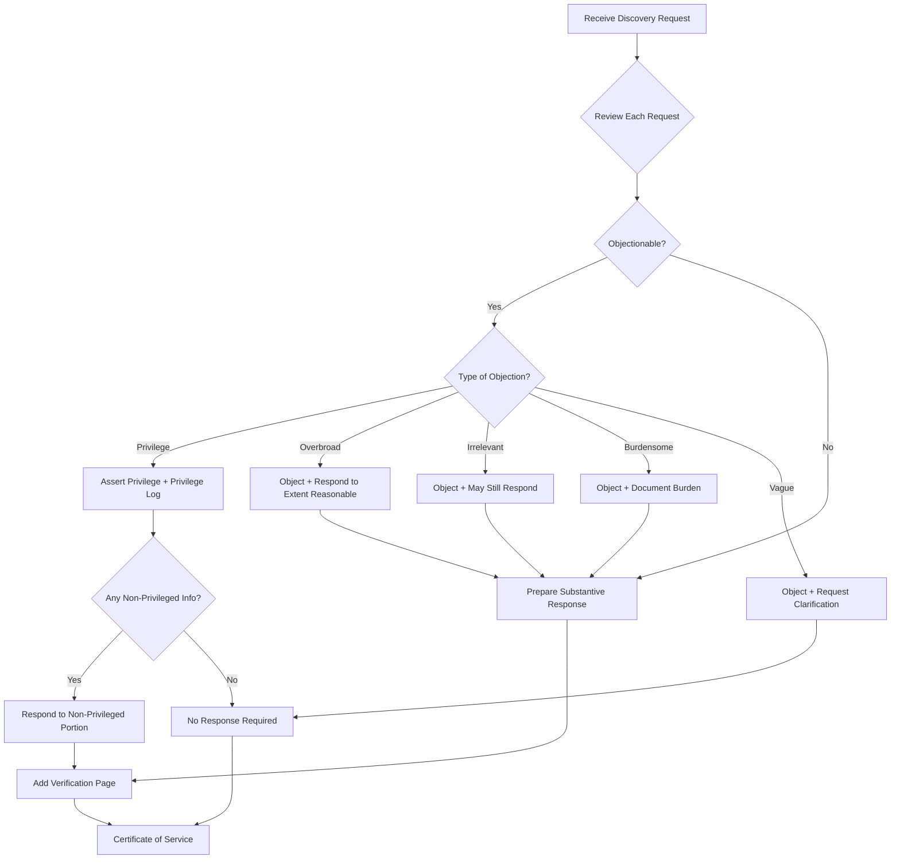

# Discovery Response Strategy - Decision Tree

## Visual Flowchart



---

## Step-by-Step Response Guide

### Step 1: Calendar Deadline

| Situation | Response Deadline |
|-----------|------------------|
| Discovery served after answer | 30 days from service |
| Discovery served with complaint | 45 days from service |
| Extension by agreement | Per stipulation |

**CR 33/34/36:** Failure to respond within deadline may result in waiver of objections.

---

### Step 2: Review Each Request

For each interrogatory, RFP, or RFA, determine:

1. **Is it understandable?** If vague, object and request clarification.
2. **Is it relevant?** Broad relevance standard applies to discovery.
3. **Is it privileged?** Attorney-client, work product, etc.
4. **Is it overbroad?** Too broad in scope or time?
5. **Is it burdensome?** Would require unreasonable effort?

---

### Step 3: Apply Objection Decision Matrix

| Issue | Objection | Still Respond? |
|-------|-----------|---------------|
| Attorney-Client Privilege | Yes | No (but create privilege log) |
| Work Product | Yes | No (but create privilege log) |
| Overbroad/Burdensome | Yes | Yes, to reasonable extent |
| Irrelevant | Yes | Often still respond |
| Vague/Ambiguous | Yes | Request clarification |
| Compound | Yes (interrogatories only) | May still respond |
| Calls for Legal Conclusion | Yes | Respond with facts |

---

### Step 4: Structure the Response

#### For Interrogatories (CR 33)

```markdown
**INTERROGATORY NO. X:**
[Quote the interrogatory]

**OBJECTION:** [If applicable]
[State specific objection with legal basis]

**ANSWER:**
[Without waiving objections, Plaintiff/Defendant responds as follows:]
[Substantive response]
```

#### For Requests for Production (CR 34)

```markdown
**REQUEST NO. X:**
[Quote the request]

**OBJECTION:** [If applicable]
[State specific objection with legal basis]

**RESPONSE:**
[Select one:]
- Documents responsive to this request will be produced.
- Documents responsive to this request are produced herewith.
- No documents responsive to this request are in Plaintiff's/Defendant's possession, custody, or control.
- See objection above.
```

#### For Requests for Admission (CR 36)

```markdown
**REQUEST FOR ADMISSION NO. X:**
[Quote the request]

**RESPONSE:**
[Select one:]
- Admitted.
- Denied.
- Plaintiff/Defendant lacks sufficient knowledge or information to admit or deny and therefore denies.
- [Qualified response explaining what is admitted and denied]
```

---

### Step 5: Privilege Log Requirements

If withholding documents on privilege grounds, create a privilege log containing:

| Required Information |
|---------------------|
| Date of document |
| Author(s) |
| Recipient(s) |
| Document type (letter, memo, email, etc.) |
| Subject matter (general description without revealing privileged content) |
| Privilege asserted |
| Basis for privilege |

---

### Step 6: Verification

**Interrogatory responses MUST be verified.**

Verification by party:
```
VERIFICATION

I, [Name], verify that I am the [Plaintiff/Defendant] in this action, that I have read the foregoing Responses to Interrogatories, and that the answers are true and correct to the best of my knowledge, information, and belief.

_____________________________
[Name]

STATE OF KENTUCKY
COUNTY OF _______________

Subscribed and sworn to before me by [Name] on this ____ day of _________, 20__.

_____________________________
Notary Public
My Commission Expires: __________
```

---

### Step 7: Certificate of Service

```
CERTIFICATE OF SERVICE

I hereby certify that a true and accurate copy of the foregoing was served upon the following by [U.S. mail, first class postage prepaid / electronic service] this ____ day of ____________, 20__:

[Opposing counsel name]
[Address]

_____________________________
[Attorney signature]
```

---

## Response Timing Strategy

### Immediate Deadlines (High Priority)
- **RFAs:** Failure to respond = deemed admitted
- **Interrogatories:** Failure to respond = waiver of objections

### Extension Requests
- Contact opposing counsel before deadline
- Reasonable extensions typically granted
- Confirm in writing

### Rolling Production (RFPs)
- Produce documents as they become available
- Serve supplemental responses
- Continue searching through response period

---

## Common Response Pitfalls to Avoid

| Pitfall | Problem | Solution |
|---------|---------|----------|
| Boilerplate objections | May be deemed waived | State specific objection for each request |
| Missing verification | Responses not valid | Ensure client signs verification |
| Late responses | Waiver of objections | Calendar and track deadlines |
| Missing privilege log | Privilege may be waived | Create log for all withheld documents |
| Over-objecting | Invites motion to compel | Object only where warranted |

---

## Related Resources

- [Response Shell Template](templates/response_shell.md)
- [General Objections](templates/general_objections.md)
- [Valid Objections Guide](references/valid_objections.md)
- [Privilege Log Template](references/privilege_log.md)
- [Verification Page](references/verification_page.md)

