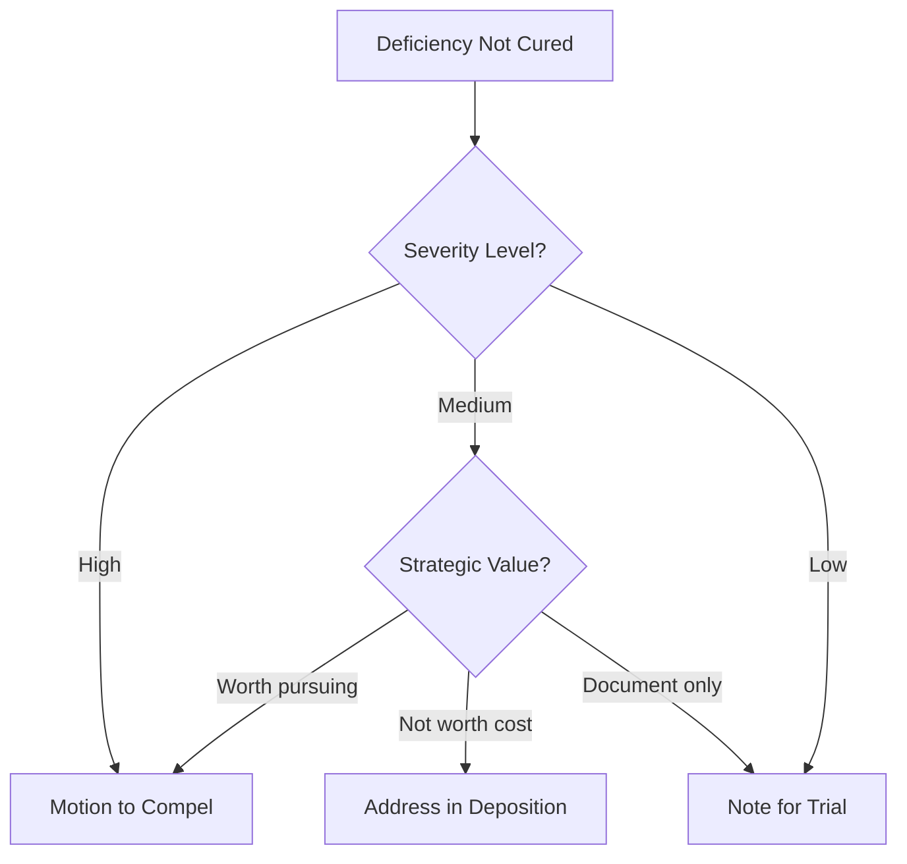

# Review Responses Workflow

## Overview

Analyze defendant's discovery responses for completeness and sufficiency. Uses the Discovery Library analysis workflows to identify deficiencies, conduct meet-and-confer, and prepare motions if needed.

## Entry Criteria

- Discovery responses received from defendant
- Need to assess completeness and sufficiency

## Discovery Library Reference

**Primary Resources:**
- [Response Deficiency Checklist](../../discovery_library/analysis/response_deficiency_checklist.md) - Systematic review checklist
- [Defense Answer Review](../../discovery_library/analysis/defense_answer_review.md) - Analyze frivolous denials
- [Meet and Confer Guide](../../discovery_library/analysis/meet_and_confer_guide.md) - Pre-motion requirements
- [Motion to Compel Outline](../../discovery_library/analysis/motion_to_compel_outline.md) - Motion structure

## Steps

### 1. Initial Review - Use Deficiency Checklist

**Owner:** Agent  
**Skill:** `response-analysis`  
**Reference:** [Response Deficiency Checklist](../../discovery_library/analysis/response_deficiency_checklist.md)  
**Action:** Systematically review each response using the checklist.

**Interrogatory Review:**
- [ ] Verification present and signed by party (not attorney)?
- [ ] Response to each interrogatory?
- [ ] Complete, non-evasive answers?
- [ ] Specific objections stated (not boilerplate)?
- [ ] Response provided despite objection?

**RFP Review:**
- [ ] Response to each request?
- [ ] Clear statement: will produce, objection, or none exist?
- [ ] Documents actually produced?
- [ ] Organized by request or as maintained?
- [ ] Privilege log for withheld documents?

**RFA Review:**
- [ ] Response to each request (or deemed admitted)?
- [ ] Clear admission, denial, or explanation?
- [ ] Reasonable inquiry for "lack of info" claims?

### 2. Categorize Deficiencies

**Owner:** Agent  
**Action:** Document deficiencies by severity.

| Severity | Description | Examples |
|----------|-------------|----------|
| **High** | Significant deficiency affecting case | No answer, missing key documents, improper blanket objection |
| **Medium** | Material deficiency | Incomplete answer, disorganized production |
| **Low** | Minor deficiency | Formatting issues, minor omissions |

**Create Deficiency Summary:**

| Request # | Type | Deficiency | Severity | Follow-Up |
|-----------|------|------------|----------|-----------|
| Int. 5 | Interrogatory | Incomplete witness list | High | Meet & confer |
| RFP 3 | Production | No privilege log | High | Letter demanding log |
| RFA 12 | Admission | Improper "lack of info" | Medium | Follow-up RFA |

### 3. Review Document Production

**Owner:** Agent  
**Action:** Catalog produced documents and identify gaps:
- [ ] All categories of requested documents addressed?
- [ ] Key documents present (insurance policies, photos, statements)?
- [ ] Documents legible and usable?
- [ ] ESI in native format with metadata?
- [ ] Conspicuous gaps or missing documents?

### 4. Analyze Defense Answer (If Applicable)

**Owner:** Agent  
**Reference:** [Defense Answer Review](../../discovery_library/analysis/defense_answer_review.md)  
**Action:** If reviewing defendant's answer to complaint, check for:
- Frivolous denials of obvious facts
- Improper "lack of information" claims
- Inconsistencies with discovery responses
- CR 8.01 violations

### 5. Prepare Meet and Confer Letter

**Owner:** Agent  
**Reference:** [Meet and Confer Guide](../../discovery_library/analysis/meet_and_confer_guide.md)  
**Action:** Draft deficiency letter per CR 37 requirements.

**Letter Must Include:**
- Specific identification of deficient responses
- Explanation of why each response is deficient
- What supplemental response would cure the deficiency
- Deadline for supplementation (typically 10 days)
- Offer to discuss by telephone

**Template Location:** `templates/deficiency_letter.md`

### 6. Conduct Meet and Confer

**Owner:** User  
**Reference:** [Meet and Confer Guide](../../discovery_library/analysis/meet_and_confer_guide.md)  
**Action:** Conference with defense counsel to resolve issues.

**Process:**
1. Send deficiency letter
2. If no response in 10 days, telephone call
3. Attempt good faith resolution
4. Document all communications
5. Confirm any agreements in writing

**Documentation Checklist:**
- [ ] Deficiency letter sent (date: ___)
- [ ] Response received? Y/N
- [ ] Telephone conference held (date: ___)
- [ ] Issues resolved? Y/N
- [ ] Confirmation letter sent (date: ___)

### 7. Evaluate Resolution Options

**Owner:** Agent/User  
**Action:** For unresolved deficiencies, determine strategy.

### 8. File Motion to Compel (If Needed)

**Owner:** User  
**Reference:** [Motion to Compel Outline](../../discovery_library/analysis/motion_to_compel_outline.md)  
**Action:** Prepare and file motion if deficiencies not cured.

**Motion Requirements:**
1. Certification of meet and confer efforts
2. Specific identification of deficient responses
3. Explanation of deficiency
4. Request for specific relief
5. Request for sanctions/fees

**Motion Components:**
- [ ] Introduction
- [ ] Certification of meet and confer
- [ ] Factual background
- [ ] Argument (with specific deficiencies)
- [ ] Request for sanctions
- [ ] Proposed order
- [ ] Exhibits (discovery, responses, correspondence)

## Exit Criteria

- [ ] All responses reviewed using checklist
- [ ] Deficiencies documented and categorized
- [ ] Meet and confer completed and documented
- [ ] Responses adequate OR motion to compel filed

## Discovery Library Analysis Resources

Location: `discovery_library/analysis/`

| Resource | Purpose |
|----------|---------|
| `defense_answer_review.md` | Identify CR 8.01 violations in pleading answers |
| `response_deficiency_checklist.md` | Systematic discovery response review |
| `meet_and_confer_guide.md` | Templates and strategy for pre-motion conferral |
| `motion_to_compel_outline.md` | Motion structure, arguments, and template |

## Timeline

| Day | Action |
|-----|--------|
| 0 | Receive responses |
| 1-3 | Complete initial review |
| 5 | Send deficiency letter |
| 15 | If no response, telephone conference |
| 17 | Send confirmation letter |
| 25-30 | If not cured, file motion |

## Related Workflows

- **Triggered By:** `propound_discovery` (after responses received)
- **May Trigger:** Motion hearing, sanctions proceedings
- **Parallel:** Deposition scheduling may proceed regardless of deficiencies
