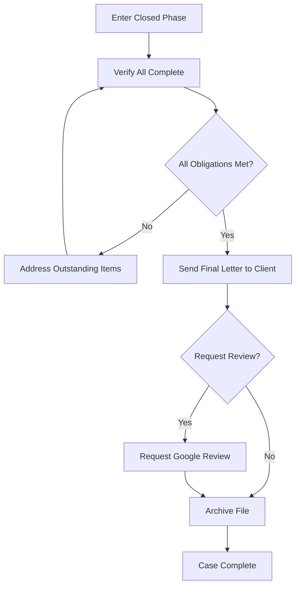

# Phase 8: Closed / Archived

## Overview

**Phase ID:** `closed`  
**Order:** 8  
**Track:** Terminal  
**State Machine Field:** `case_state.current_phase = "closed"`

The Closed phase handles final documentation, client communication, and file archival. This is the terminal phase - cases do not normally progress from here, though reopening is possible in limited circumstances.

This phase has no hard blockers - completion is determined by final tasks being completed.

---

## Entry Triggers

The case enters Closed when:
- **`client_paid`**: Client has received final distribution
- **`verdict_rendered`**: Trial verdict rendered (and any judgment collected)
- **`case_declined`**: Case was declined during intake
- **`case_withdrawn`**: Representation withdrawn

---

## Exit Criteria

### Hard Blockers

None - this is a terminal phase.

### Completion Criteria

| Criterion | Description |
|-----------|-------------|
| `file_archived` | File has been properly archived |

---

## Workflows in This Phase

| Workflow ID | Name | Description | SOP Path |
|-------------|------|-------------|----------|
| `close_case` | Close Case | Final case closure and archiving | [workflows/close_case.md](workflows/close_case.md) |

---

## Workflow Flow

---

## Skills Required

| Skill | Used By | Purpose |
|-------|---------|---------|
| `docx` | close_case | Generate closing letter |

---

## Final Verification Checklist

Before closing, verify:

- [ ] All settlement/verdict funds distributed
- [ ] All liens paid
- [ ] Client received their funds
- [ ] All parties released
- [ ] All court requirements satisfied (if litigation)
- [ ] Trust account reconciled (zero balance for this client)

---

## Client Final Letter

The closing letter should include:

| Element | Content |
|---------|---------|
| Gratitude | Thank client for choosing the firm |
| Summary | Brief recap of case outcome |
| Files | Advise client their files are available if needed |
| Future Contact | Encourage future contact if needed |
| Review Request | If appropriate, request online review |

---

## File Retention Requirements

**Kentucky Requirements:**
- Minimum 5 years retention after case closure
- Longer for minors (until age of majority + 5 years)
- Client consent needed for destruction

**Archive Contents:**
- Original signed documents
- All correspondence
- All pleadings (if litigation)
- Settlement/verdict documentation
- Financial records

---

## Case Reopening

### Can Reopen If

- `client_returned`: Client has new related matter
- `new_insurance_discovered`: Additional coverage found

### Cannot Reopen If

- `settlement_completed`: Full settlement executed and paid
- `verdict_paid`: Judgment satisfied

---

## Review Request Criteria

Request a Google review if:
- ✅ Good case outcome
- ✅ Good client relationship throughout
- ✅ Client expressed satisfaction
- ✅ No significant issues during representation

Do NOT request if:
- ❌ Poor outcome
- ❌ Client expressed dissatisfaction
- ❌ Contentious relationship
- ❌ Case declined (no representation provided)

---

## Archival Process

### Physical Files

1. Compile all original documents
2. Remove duplicates and non-essential copies
3. Organize in archive folders
4. Label with case name, number, closure date
5. Store in archive location
6. Log in archive database

### Digital Files

1. Ensure all documents saved to case folder
2. Export from case management system if needed
3. Backup to archive storage
4. Verify backup integrity
5. Mark case as archived in system

---

## Next Phase

**None** - This is the terminal phase.

---

## Related Resources

- **Forms:** `forms/closing/`
- **Education:** `education/general_practice/case_closure/`
- **Checklists:** `workflow_engine/checklists/closure_checklist.md`

