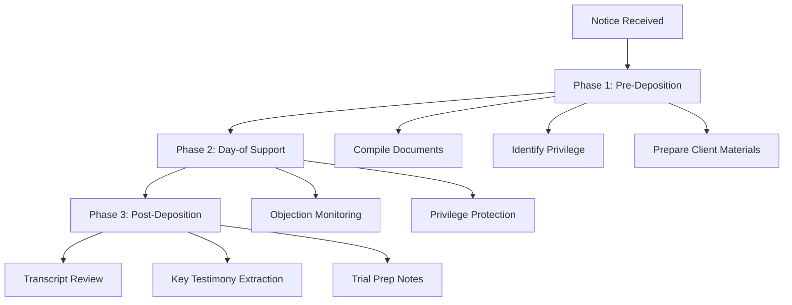

# Deposition Defense Skill

## Overview

Support client deposition defense by preparing materials, identifying privilege issues, and analyzing testimony.

## When to Use

Use when:
- Client deposition notice received
- Need to prepare client for deposition
- Need to compile documents for review
- Post-deposition transcript analysis needed

DO NOT use for:
- Taking depositions (use `rules-based-examination` or `corp-rep-deposition`)
- Expert depositions (use `expert-deposition`)

## Workflow Reference

## Phase 1: Pre-Deposition

### Step 1: Review Notice

- Extract date, time, location, court reporter
- Identify scope and topics
- Check notice adequacy under CR 30.02(1)
- Calendar all deadlines

### Step 2: Compile Documents

Gather and organize:
- Medical records (injury-related)
- Incident/accident reports
- Photographs
- Correspondence
- Employment records (if relevant)
- Insurance documents
- Prior statements by client

**See:** `references/client_defense/pre_deposition.md`

### Step 3: Identify Privilege Issues

Review for attorney-client privilege (KRE 503):
- Communications between client and attorney
- Work product materials
- Any court-ordered limitations

**See:** `templates/client_prep/privilege_review.md`

### Step 4: Prepare Client Materials

Create:
- Client preparation letter → `templates/client_prep/client_letter.md`
- Preparation checklist → `templates/client_prep/client_checklist.md`
- Timeline of relevant events
- List of likely question topics

## Phase 2: Day-of Support

### Objection Monitoring

Track for form objections:
- Leading
- Calls for speculation
- Asked and answered
- Argumentative
- Assumes facts not in evidence
- Calls for legal conclusion
- Lacks foundation
- Compound
- Calls for narrative

**See:** `references/client_defense/objections_guide.md`

### Privilege Protection

Watch for questions about:
- Attorney communications
- Legal advice
- Litigation strategy
- Settlement discussions

**Instruction not to answer** only for:
1. Preserve privilege
2. Enforce court limitation
3. Present CR 30.04 motion

### Bad Faith Monitoring

Flag for CR 30.04 motion:
- Badgering
- Repetitive harassment
- Personal attacks
- Conduct designed to annoy/embarrass

**See:** `references/client_defense/day_of_support.md`

## Phase 3: Post-Deposition

### Transcript Review

When transcript arrives:
- Check for errors
- Identify substantive irregularities
- Prepare errata sheet if needed

### Key Testimony Extraction

Document with page:line citations:
- Favorable admissions
- Unfavorable testimony
- Testimony supporting case theory
- Testimony contradicting case theory
- Potential impeachment material

### Objection Catalog

Log all objections made:
- Question
- Objection type
- Ruling/response
- CR 32.04 waiver analysis

**See:** `references/client_defense/post_analysis.md`

## Outputs

### Pre-Deposition
- Deposition notice summary
- Document compilation index
- Privilege issue memo
- Anticipated topics list
- Client preparation packet

### Post-Deposition
- Transcript review summary
- Key testimony log with citations
- Objection catalog with waiver analysis
- Trial preparation memo

## Quality Checklist

- [ ] All dates verified from notice
- [ ] Documents comprehensive
- [ ] Privilege issues flagged
- [ ] Objection categories correct
- [ ] Page:line citations accurate
- [ ] CR 32.04 waiver analysis complete

## References

- `references/client_defense/pre_deposition.md`
- `references/client_defense/objections_guide.md`
- `references/client_defense/day_of_support.md`
- `references/client_defense/post_analysis.md`

## Related Skills

- `corp-rep-deposition` - Taking corporate representative depositions
- `expert-deposition` - Taking defense expert depositions
- `rules-based-examination` - Rules-based deposition questioning

