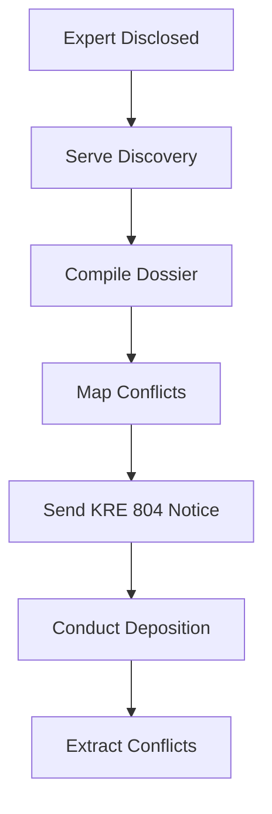

# Expert Deposition Skill

## Overview

Prepare for and conduct defense expert depositions with focus on conflict creation for trial use.

## When to Use

Use when:
- Defendants disclose expert witnesses
- DME/IME deposition is scheduled
- Need conflict material for trial
- Daubert/reliability challenge anticipated

DO NOT use for:
- Preparing our expert (different process)
- Individual party depositions (use `rules-based-examination`)
- Corporate depositions (use `corp-rep-deposition`)

## Core Philosophy

**Treat expert depositions as trial testimony.**

- Video record for trial use
- Include trial-use language in notice
- Send KRE 804 preservation notice
- Create conflicts for impeachment

## Workflow



## Phase 1: Pre-Deposition Discovery

### Step 1: Expert Interrogatory (CR 26.02(4))

Request:
- Expert's specialty
- Materials reviewed
- Each opinion with grounds

### Step 2: Document Request (60-Day Rule)

Serve RFP at least 60 days before deposition for:
- Complete file materials and notes
- All correspondence with defense counsel
- Draft reports
- Publications relied upon
- Compensation records
- Prior testimony list

### Step 3: Privilege Log Interrogatory

Ask if materials withheld; if so, demand privilege log.

**Waiver opportunity:** Deficient log = *Baptist Healthcare v. Goodman* argument.

**See:** `references/expert_depo/dossier_compilation.md`

## Phase 2: Dossier Compilation

### Database Searches

- [ ] TrialSmith - Prior testimony
- [ ] Crowdsource Depos - Transcripts
- [ ] PACER/State ECF - Court filings

### Publications

- [ ] PubMed - Peer-reviewed articles
- [ ] Google Scholar - Publications
- [ ] Expert's books/chapters

### Background

- [ ] Licensing board - Disciplinary actions
- [ ] Secretary of State - Business affiliations
- [ ] Social media - Bias indicators

### Dossier Outputs

1. Expert profile (1-2 pages)
2. Prior testimony index
3. Publication analysis
4. Conflict mapping document

## Phase 3: Conflict Mapping

### Conflict Types

| Type | Target Jurors | Focus |
|------|--------------|-------|
| Hired Gun | Tribals | Compensation, defense-only work |
| Snap Judgment | Tribals | Opinion before reviewing all materials |
| Rules of the Road | All | Principles expert cannot deny |
| Squaring Up | Moderates | Prior inconsistent testimony |
| Treatise Contradiction | Moderates | Authoritative text disagreement |
| Methodology Flaw | Progressives | Scientific process errors |

**See:** `references/expert_depo/conflict_mapping.md`

### Juror Archetype Targeting

Match conflicts to likely jury:
- Rural venue → Tribal focus
- Suburban → Moderate focus
- Urban → Progressive focus

**See:** `references/expert_depo/juror_archetypes.md`

## Phase 4: Trial Preservation

### KRE 804 Notice

Send 3-5 days before deposition:
```
Plaintiff intends to use this deposition at trial under KRE 804(b)(1).
Defense is on notice to examine with trial-like motive.
```

### Notice Language (Required)

Include in deposition notice:
```
Said deposition will be taken by stenographic and video methods and 
for any and all purposes permitted by the Kentucky Rules of Civil 
Procedure, including use as evidence at the trial in this matter.
```

### CR 32.01 Verification

At deposition, verify:
```
Q. You are a practicing physician?
Q. Where is your primary practice?
Q. Is that more than 100 miles from [courthouse]?
```

**See:** `references/expert_depo/trial_preservation.md`

## Deposition Outline

Use template: `templates/outlines/outline_expert.md`

### Structure

1. **Credentials** - Establish for later use
2. **Compensation/Bias** - Hired gun evidence
3. **Retention Timeline** - Snap judgment exposure
4. **Materials Reviewed** - What was NOT reviewed
5. **Rules of the Road** - Get agreements
6. **Specific Opinions** - Apply rules
7. **Squaring Up** - Prior inconsistencies
8. **Treatise Confrontation** - KRE 803(18)
9. **Closing** - Final opportunities

## Outputs

### Pre-Deposition
- Expert dossier
- Conflict mapping document
- KRE 804 notice
- Deposition notice with trial-use language
- Examination outline

### Post-Deposition
- Conflict summary with page:line citations
- Impeachment materials
- Trial designation verification
- Closing argument foundations

## Document Generation

```bash
# Copy notice template
cp "/path/to/deposition_library/templates/notices/notice_expert.md" \
   "/{project}/Litigation/Discovery/Expert_Depo_Notice.md"

# Agent fills expert details
# Generate DOCX/PDF
python ${ROSCOE_ROOT}/Tools/document_generation/generate_document.py \
    "/{project}/Litigation/Discovery/Expert_Depo_Notice.md"
```

## Quality Checklist

- [ ] Expert interrogatory served early
- [ ] RFP served 60+ days before deposition
- [ ] Dossier compiled with prior testimony
- [ ] Conflict opportunities identified
- [ ] KRE 804 notice sent before deposition
- [ ] Notice includes trial-use language
- [ ] Video recording arranged
- [ ] CR 32.01 criteria will be verified

## References

- `references/expert_depo/dossier_compilation.md`
- `references/expert_depo/conflict_mapping.md`
- `references/expert_depo/juror_archetypes.md`
- `references/expert_depo/trial_preservation.md`

## Related Skills

- `rules-based-examination` - For establishing rules
- `corp-rep-deposition` - For corporate depositions
- `deposition-defense` - For defending client depositions

