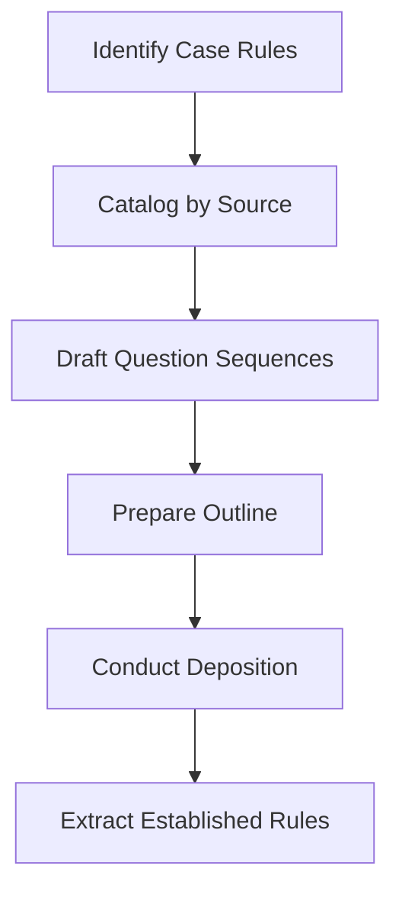

# Rules-Based Examination Skill

## Overview

Conduct depositions using the rules-based framework: establish general principles first, then apply to case facts.

## When to Use

Use when:
- Deposing individual adverse party
- Deposing fact witnesses
- Need to establish safety standards
- Building closing argument foundation

DO NOT use for:
- Corporate depositions (use `corp-rep-deposition`)
- Expert depositions (use `expert-deposition`)
- Defending client depositions (use `deposition-defense`)

## Core Concept

### Traditional (Less Effective)
1. Ask about facts
2. Ask about policies
3. Hope for admission

### Rules-Based (More Effective)
1. Establish rules **in a vacuum**
2. Get agreement to common sense
3. **Then** apply to facts
4. Witness trapped by prior agreements

## Workflow



## Phase 1: Rule Discovery

### Authoritative Sources

| Source | Examples |
|--------|----------|
| Statutes | KRS Chapter 189 (traffic) |
| Regulations | FMCSA, OSHA |
| Case Law | Jury instructions |
| Defendant's Policies | Employee handbooks |
| Industry Standards | Best practices |
| Common Sense | Universal principles |

### Four-Part Test

Every rule must be:
1. **Understandable** - Plain language
2. **Undeniable** - Disagreement damages credibility
3. **Violated** - Clear evidence of breach
4. **Important** - Linked to client's harm

**See:** `references/rules_framework/rule_discovery.md`

## Phase 2: Rule Inventory

### Template

| Rule ID | Rule Text | Source | Violation Evidence |
|---------|-----------|--------|-------------------|
| R-001 | [Plain language rule] | [Source] | [Evidence] |

### Framing Rules

- Convert "should" to "must"
- Use active voice
- Keep simple
- State as affirmative duty

## Phase 3: Question Drafting

### Framework

```
Q. [General principle statement]. Do you agree with that?
Q. [More specific application]. Do you agree?
Q. [Connect to defendant's duty]. Do you agree?
Q. Would violation of this rule be [careless/reckless/dangerous]?
```

### Escalation Words

Progress from less to more severe:
1. Careless
2. Negligent
3. Reckless
4. Dangerous

**See:** `references/rules_framework/question_frameworks.md` for case-type examples.

## Phase 4: Deposition Outline

Use template: `templates/outlines/outline_rules_based.md`

### Structure

1. **Background** (brief)
2. **Rules Establishment** (BEFORE facts)
3. **Company Policies/Training**
4. **Application to Case Facts**
5. **Prior Incidents/Notice**
6. **Closing Gambit**

## Closing Gambit

**Critical final technique:**

```
Q. Looking back at this incident, were any mistakes made?

[IF YES:]
Q. What mistakes were made?
Q. Why did those mistakes happen?
Q. What has been done to prevent this from happening again?

[IF NO:]
Q. So your conduct was exactly as expected and trained?
Q. If you had to do it all over again, you would do nothing different?
Q. The company's procedures were followed exactly as designed?
Q. And this [injury/accident] still occurred?
```

### Strategic Value

- **Mistakes acknowledged** → Admission of fault
- **No mistakes** → Conduct was intentional; powerful closing argument

## Handling Objections

### "Calls for Legal Opinion"

> "I'm asking about agreed-upon standards, customs, guidelines, or principles in [their industry/profession]."

### "Calls for Speculation"

> "I'm asking about the witness's understanding of [safety standards/company policy]."

## Phase 5: Post-Deposition Extraction

### Capture for Each Rule

| Field | Data |
|-------|------|
| Rule ID | R-001 |
| Rule Text | Exact verbatim |
| Witness Response | Exact verbatim |
| Classification | Agreement/Disagreement/Evasion |
| Page:Line | Citation |

### Classification Impact

- **Agreement** → Summary judgment support
- **Disagreement** → Credibility argument
- **Evasion** → Impeachment opportunity

**See:** `references/rules_framework/transcript_extraction.md`

## Outputs

### Pre-Deposition
- Rule inventory table
- Deposition outline with question sequences
- Objection response scripts

### Post-Deposition
- Rule annotation log with citations
- Closing gambit result
- Trial preparation memo
- Closing argument framework

## Document Generation

```bash
# Copy outline template
cp "/path/to/deposition_library/templates/outlines/outline_rules_based.md" \
   "/{project}/Litigation/Discovery/Depo_Outline_[Witness].md"

# Agent fills rules and questions
```

## Case-Type Quick Reference

| Case Type | Key Rules Focus |
|-----------|-----------------|
| MVA | Lookout, speed, stop signs, yielding |
| Premises | Inspection, warnings, floor safety |
| Trucking | Hours, qualifications, pre-trip |
| Nursing Home | Falls, call response, documentation |
| DUI | Impairment, traffic laws, recklessness |

## Quality Checklist

- [ ] Rules meet all four criteria
- [ ] Rules sourced from authoritative materials
- [ ] Rules framed as mandatory ("must")
- [ ] Questions in plain language
- [ ] Outline follows rules-before-facts structure
- [ ] Closing gambit prepared
- [ ] Extraction template ready

## References

- `references/rules_framework/rule_discovery.md`
- `references/rules_framework/question_frameworks.md`
- `references/rules_framework/transcript_extraction.md`

## Related Skills

- `corp-rep-deposition` - For corporate depositions
- `expert-deposition` - For defense expert depositions
- `deposition-defense` - For defending client depositions

