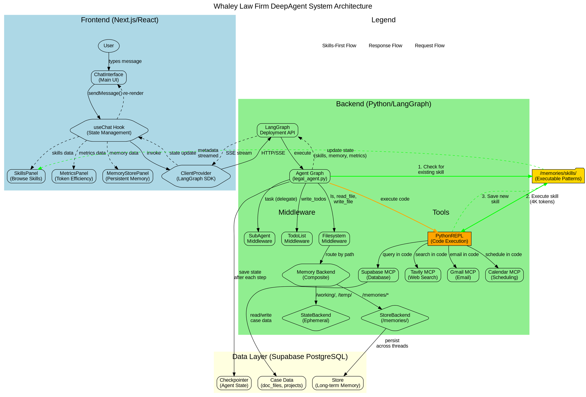

# System Architecture

## Overview

The Whaley Law Firm DeepAgent system is a full-stack AI application consisting of:

1. **Backend**: Python-based DeepAgent using LangGraph, implementing Anthropic's Code Execution pattern for maximum token efficiency
2. **Frontend**: Next.js/React UI for real-time interaction and monitoring
3. **Database**: Supabase PostgreSQL for all persistence (checkpointer, store, case data)

**Key Innovation**: Skills-first workflow achieving 88-98% token reduction through reusable executable patterns stored in `/memories/skills/`.

---

## Module Architecture

### Backend Modules

#### Module 1: Agent Core (`src/agents/legal_agent.py`)

**Purpose**: Main agent orchestration and configuration

**Responsibilities**:
- Initialize DeepAgent with all middleware (TodoList, Filesystem, SubAgent)
- Configure PythonREPLTool for code execution
- Load and attach MCP server tools (Supabase, Tavily, Gmail, Calendar)
- Define system prompt with skills-first workflow instructions
- Configure memory backends (StateBackend for ephemeral, StoreBackend for persistent)
- Setup subagents for specialized tasks (legal research, email, database, scheduling)
- Compile graph with PostgresSaver checkpointer

**Key Functions**:
- `make_backend(runtime)` - Returns CompositeBackend routing /memories/ to StoreBackend
- `graph = agent.compile(checkpointer)` - Produces executable LangGraph

**Exports**: `graph` (compiled agent graph)

#### Module 2: Configuration (`src/config/settings.py`)

**Purpose**: Environment variable management and configuration utilities

**Responsibilities**:
- Load .env file using dotenv
- Provide database URI from Supabase credentials
- Expose API keys for LLMs and MCP servers
- Validate required environment variables on startup

**Key Functions**:
- `get_setting(key, default=None)` - Safe environment variable access
- `DB_URI` - Constructed PostgreSQL connection string

**Exports**: `DB_URI`, `get_setting()`

#### Module 3: MCP Clients (`src/mcp/clients.py`)

**Purpose**: Initialize and configure all MCP server clients

**Responsibilities**:
- Create MultiServerMCPClient instances for each MCP server
- Configure command and environment for npx-based servers
- Extract tool lists from each MCP server
- Handle MCP connection errors gracefully

**Key Functions**:
- `init_supabase_mcp()` - Returns supabase_tools list
- `init_tavily_mcp()` - Returns tavily_tools list
- `init_gmail_mcp()` - Returns gmail_tools list
- `init_calendar_mcp()` - Returns calendar_tools list

**Exports**: `supabase_tools`, `tavily_tools`, `gmail_tools`, `calendar_tools`

### Frontend Modules

#### Module 4: State Management (`src/app/hooks/useChat.ts`)

**Purpose**: Central state hook connecting to LangGraph backend

**Responsibilities**:
- Use @langchain/langgraph-sdk's useStream hook
- Extend StateType to include skills, memory, metrics
- Provide methods for sending messages, running single steps
- Handle thread management and interrupts
- Expose state fields for UI consumption

**Key Functions**:
- `sendMessage(content)` - Send user message to agent
- `runSingleStep(messages, checkpoint)` - Debug mode step execution
- `continueStream()` - Resume after interrupt

**Exports**: `useChat` hook

#### Module 5: Code Execution Display (`src/app/components/CodeExecutionBox.tsx`)

**Purpose**: Render Python code execution with syntax highlighting

**Responsibilities**:
- Display syntax-highlighted Python code using react-syntax-highlighter
- Show execution status (pending, completed, error)
- Display output/result in formatted pre block
- Show skill execution badge if using saved skill
- Display execution time if available

**Key Props**:
- `code: string` - Python code executed
- `result: string` - Execution output
- `status: ToolCall['status']` - Execution status
- `isSkillExecution?: boolean` - Flag for skill usage
- `skillName?: string` - Name of skill if used

**Exports**: `CodeExecutionBox` component

#### Module 6: Skills Library UI (`src/app/components/SkillsPanel.tsx`)

**Purpose**: Browse and manage skills from /memories/skills/

**Responsibilities**:
- Display all available skills with metadata
- Provide search/filter functionality
- Show token savings per skill and total
- Allow viewing full skill source code
- Populate chat input with skill usage example

**Key Functions**:
- `handleViewSkill(skillName)` - Open skill source dialog
- `handleUseSkill(skillName)` - Insert usage into chat input
- Filter skills by search term

**Exports**: `SkillsPanel` component

#### Module 7: Memory Store UI (`src/app/components/MemoryStorePanel.tsx`)

**Purpose**: Browse persistent memory from /memories/

**Responsibilities**:
- Display tree view of memory paths
- Show memory item details (data, timestamps)
- Collapse/expand folders
- Search across memory items

**Key Functions**:
- `buildTreeFromPaths(paths)` - Convert flat paths to tree structure
- `handleTogglePath(path)` - Expand/collapse folder
- `handleViewItem(path)` - Show memory item details

**Exports**: `MemoryStorePanel` component

#### Module 8: Token Metrics Dashboard (`src/app/components/MetricsPanel.tsx`)

**Purpose**: Display token efficiency metrics and cost savings

**Responsibilities**:
- Show total tokens used vs. saved
- Calculate efficiency percentage
- Display skills executed count
- Estimate cost savings based on pricing
- Visualize comparison (with skills vs. without)

**Key Functions**:
- `calculateEfficiency(metrics)` - Compute percentage
- `estimateCostSavings(tokensSaved)` - Convert to dollars

**Exports**: `MetricsPanel` component

#### Module 9: Tool Categorization (`src/app/utils/toolCategories.ts`)

**Purpose**: Categorize tools by MCP server for visual organization

**Responsibilities**:
- Detect tool category from tool name
- Provide icons for each category
- Provide color classes for badges
- Support filtering by category

**Key Functions**:
- `getMCPCategory(toolName)` - Returns category enum
- `CATEGORY_ICONS` - Map of category to emoji
- `CATEGORY_COLORS` - Map of category to Tailwind classes

**Exports**: `getMCPCategory()`, `CATEGORY_ICONS`, `CATEGORY_COLORS`

---

## Data Flow

### Primary Data Flow: User Message to Agent Response

```
1. User types message in ChatInterface
2. ChatInterface calls sendMessage() from useChat hook
3. useChat sends message to LangGraph SDK client
4. Client makes HTTP request to LangGraph Deployment API
5. API invokes agent graph (src/agents/legal_agent.py)
6. Agent processes message:
   a. If complex task: use write_todos to plan
   b. Check /memories/skills/ for existing skill (ls, read_file)
   c. If skill found: execute via python_repl (4K tokens)
   d. If no skill: write Python code, execute via python_repl (12K tokens)
   e. Query MCP tools in code (data stays in execution environment)
   f. Process/filter data in Python (not LLM context)
   g. Return summary only to LLM
7. Agent updates state:
   - state["messages"].append(response)
   - state["skills"] if skill executed or created
   - state["memory"] if persistent data saved
   - state["metrics"] with token counts
8. State streamed to frontend via Server-Sent Events
9. useStream hook receives state update
10. React components re-render with new data
11. User sees response in ChatInterface
```

### Skills Library Flow

```
1. Agent completes complex multi-step task
2. Agent writes successful workflow as Python function
3. Agent saves to /memories/skills/{name}.py using write_file
4. FilesystemMiddleware routes to StoreBackend (persistent)
5. File saved to PostgresStore in Supabase
6. Agent updates state["skills"] with metadata:
   - name, path, description, usage, timesUsed=0, tokensSaved=0
7. State streamed to frontend
8. SkillsPanel receives update, shows new skill
9. Next time similar task occurs:
   a. Agent checks /memories/skills/ (ls)
   b. Finds matching skill
   c. Executes directly (4K tokens vs 32K)
   d. Updates timesUsed++, tokensSaved+= estimate
   e. Streams updated metadata to frontend
```

### Memory Persistence Flow

```
1. Agent needs to store persistent data
2. Agent calls write_file with path starting with /memories/
3. FilesystemMiddleware detects /memories/ prefix
4. CompositeBackend routes to StoreBackend
5. StoreBackend saves to PostgresStore
6. Data persists in Supabase PostgreSQL
7. Available across all threads and sessions
8. Agent can read_file to retrieve later
9. Frontend can display via MemoryStorePanel
```

---

## Control Flow

### Agent Execution Flow (Skills-First)

```
START: User message received
  │
  ├─► Parse task intent
  │
  ├─► Is task complex (multi-step)?
  │   ├─ YES: Call write_todos tool to plan
  │   └─ NO: Continue
  │
  ├─► Call ls /memories/skills/ (check for existing skill)
  │
  ├─► Skill found matching task?
  │   │
  │   ├─ YES: Execute skill via python_repl
  │   │       └─► exec(open('/memories/skills/{skill}.py').read())
  │   │       └─► Call run_skill() function
  │   │       └─► Return result (4K tokens) ✅ 88% savings
  │   │       └─► Update state["skills"] metadata
  │   │       └─► DONE
  │   │
  │   └─ NO: Discover tools needed
  │           │
  │           ├─► Identify MCP servers needed (Supabase? Tavily? Gmail?)
  │           │
  │           ├─► Write Python code combining tools
  │           │
  │           ├─► Execute code via python_repl
  │           │   └─► Query MCP tools in code (data stays local)
  │           │   └─► Filter/process in Python (not LLM)
  │           │   └─► Return summary only (12K tokens) ✅ 62% savings
  │           │
  │           ├─► Generate natural language response
  │           │
  │           ├─► Was workflow complex and successful?
  │           │   ├─ YES: Suggest saving as skill
  │           │   │       └─► Agent writes Python function
  │           │   │       └─► Saves to /memories/skills/{name}.py
  │           │   │       └─► Updates state["skills"]
  │           │   └─ NO: Skip skill creation
  │           │
  │           └─► DONE
  │
END: Response streamed to user
```

### Subagent Delegation Flow

```
START: Task requires specialized handling
  │
  ├─► Identify subagent needed
  │   ├─ Legal research? → legal-researcher subagent
  │   ├─ Email? → email-manager subagent
  │   ├─ Database? → database-specialist subagent
  │   └─ Scheduling? → scheduler subagent
  │
  ├─► Call task tool with subagent name and input
  │
  ├─► SubAgentMiddleware spawns new graph instance
  │   └─► Subagent has isolated context
  │   └─► Subagent has specialized tools
  │   └─► Subagent has custom system prompt
  │
  ├─► Subagent executes task
  │   └─► May save results to /working/ for main agent
  │
  ├─► Subagent returns result
  │
  ├─► Main agent receives result
  │
  └─► Main agent incorporates into response
  │
END: Subagent work complete
```

---

## External Dependencies

### Backend Dependencies

| Dependency | Version | Why Needed |
|------------|---------|------------|
| `deepagents` | >=0.1.0 | Core library for DeepAgent pattern with built-in middleware |
| `langgraph` | >=0.3.0 | Graph orchestration framework, basis for deepagents |
| `langchain` | >=0.3.0 | LLM abstraction and tool calling |
| `langchain-anthropic` | >=0.3.0 | Claude Sonnet 4.5 integration |
| `langchain-openai` | >=0.3.0 | GPT-4o integration for subagents |
| `langchain-experimental` | >=0.3.0 | **PythonREPLTool** for code execution (Anthropic pattern) |
| `langchain-mcp-adapters` | >=0.1.0 | Integrate MCP servers as LangChain tools |
| `langgraph-checkpoint-postgres` | >=2.0.0 | Persist agent state to Supabase PostgreSQL |
| `psycopg[binary,pool]` | >=3.0.0 | PostgreSQL driver with connection pooling |
| `supabase` | >=2.0.0 | Supabase Python client (optional, for direct access) |
| `python-dotenv` | >=1.0.0 | Load environment variables from .env file |

### Frontend Dependencies

| Dependency | Version | Why Needed |
|------------|---------|------------|
| `@langchain/langgraph-sdk` | ^0.1.10 | Connect to LangGraph deployment, stream state |
| `@langchain/core` | ^0.3.49 | Core types for messages, checkpoints |
| `next` | 15.4.6 | React framework with SSR and routing |
| `react` | 19.1.0 | UI library |
| `react-dom` | 19.1.0 | React DOM rendering |
| `react-syntax-highlighter` | ^15.6.1 | **Syntax highlighting for Python code** |
| `@radix-ui/*` | Various | Accessible UI primitives (Dialog, Tabs, etc.) |
| `tailwindcss` | ^3.4.4 | Utility-first CSS framework |
| `typescript` | ^5.9.3 | Type safety for React components |

### External Services

| Service | Why Needed |
|---------|------------|
| **Supabase PostgreSQL** | Single database for checkpointer, store, and case data. Eliminates need for separate databases. |
| **Anthropic API** | Claude Sonnet 4.5 for main agent and legal research subagent |
| **OpenAI API** | GPT-4o for email and scheduling subagents (optional, can use Claude) |
| **Tavily API** | Web search for legal research |
| **Gmail API** | Email management via MCP server |
| **Google Calendar API** | Scheduling via MCP server |
| **Node.js/npm** | Required to run MCP servers (npx command) |

---

## Error Handling Strategy

### Backend Error Handling

#### Strategy 1: Graceful Degradation

**Principle**: Agent should continue operating even if some tools fail.

**Implementation**:
- Wrap MCP server initialization in try/except
- If MCP server fails to connect, log warning and continue without those tools
- Agent prompt includes fallback instructions if certain tools unavailable

**Example**:
```python
try:
    supabase_tools = supabase_mcp.list_tools()
except Exception as e:
    logger.warning(f"Supabase MCP failed: {e}")
    supabase_tools = []  # Continue without Supabase tools
```

#### Strategy 2: Tool Call Error Recovery

**Principle**: If tool call fails, agent should understand error and retry or pivot.

**Implementation**:
- Tool errors returned as ToolMessage with error details
- Agent sees error in context, can analyze and retry with different approach
- After 3 failed attempts, agent reports error to user with explanation

#### Strategy 3: Code Execution Safety

**Principle**: Python code execution must be isolated and safe.

**Implementation**:
- PythonREPLTool runs in restricted environment
- Timeout enforced (default 60s)
- No file system access outside workspace
- No network access except through MCP tools
- If code raises exception, error returned to agent

#### Strategy 4: Checkpointer Resilience

**Principle**: Agent state must be recoverable after failures.

**Implementation**:
- State saved to PostgreSQL after every step
- If agent crashes, restart from last checkpoint
- Thread ID allows resuming exact conversation
- Checkpoints expire after 7 days (configurable)

### Frontend Error Handling

#### Strategy 1: Connection Loss Recovery

**Principle**: UI should handle backend disconnections gracefully.

**Implementation**:
- useStream hook has `reconnectOnMount: true`
- Shows "Reconnecting..." indicator during connection loss
- Automatically resumes streaming when connection restored
- Queued messages sent after reconnection

#### Strategy 2: State Sync Errors

**Principle**: Handle cases where state updates fail or are invalid.

**Implementation**:
- Default values for all state fields (skills ?? {}, memory ?? {})
- Type guards validate state structure before rendering
- If invalid state received, show error boundary, allow refresh
- Previous valid state cached, can revert on error

#### Strategy 3: Component Render Errors

**Principle**: One component error shouldn't crash entire UI.

**Implementation**:
- React Error Boundaries wrap major component trees
- Error boundary shows friendly error message
- User can continue using other parts of UI
- Error logged to console for debugging

---

## Invariants

### System Invariants

1. **Skills are immutable**: Once saved, skill source code never modified automatically (only by user or new version)
2. **Memory paths are hierarchical**: All `/memories/` paths follow directory structure, no flat namespace
3. **State is serializable**: All agent state must be JSON-serializable for checkpointing
4. **Tool calls are idempotent**: Retrying same tool call with same inputs produces same result (or fails gracefully)
5. **Threads are isolated**: Thread ID uniquely identifies conversation, no cross-thread contamination
6. **Skills-first is mandatory**: Agent MUST check `/memories/skills/` before attempting any multi-step task

### Data Invariants

1. **Skills have unique names**: No two skills can have same filename in `/memories/skills/`
2. **Metrics are cumulative**: `total_tokens_used` and `total_tokens_saved` only increase, never decrease
3. **Checkpoints are ordered**: Each checkpoint has higher revision number than previous
4. **Messages are append-only**: Message list grows monotonically, never truncated (except by user clearing thread)

---

## Top-Level Flow Diagram (Graphviz DOT)



---

## Validation Checklist (To be completed after plans)

- [ ] All files in FILE_INVENTORY.md have corresponding `.nlplan.md` files
- [ ] Every `[uses: ...]` reference resolves to a `[defines: ...]` entry
- [ ] No orphan definitions or dangling references
- [ ] No circular dependencies without mitigation plan
- [ ] All plans include imports, object list, and ≥5 intent lines
- [ ] No plan exceeds 120 intent lines (verbosity cap)
- [ ] Plans contain **no code**, only natural language
- [ ] SYMBOL_INDEX.json is complete and resolvable
- [ ] DOT diagram compiles successfully (syntactically valid)

---

## Next Steps

After this architecture is approved:

1. Create detailed natural language plans (`.nlplan.md`) for each file
2. Build SYMBOL_INDEX.json with all cross-references
3. Validate all plans and references
4. Wait for user approval: **`Approves, spec`**
5. Begin implementation with traceability

---

*This architecture follows the blueprint-then-code skill specification. No code will be written until all plans are complete, validated, and explicitly approved.*
