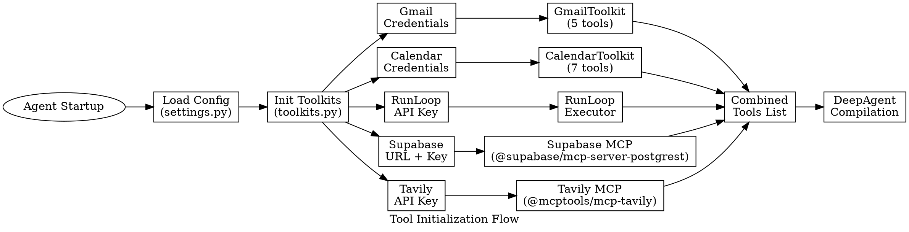
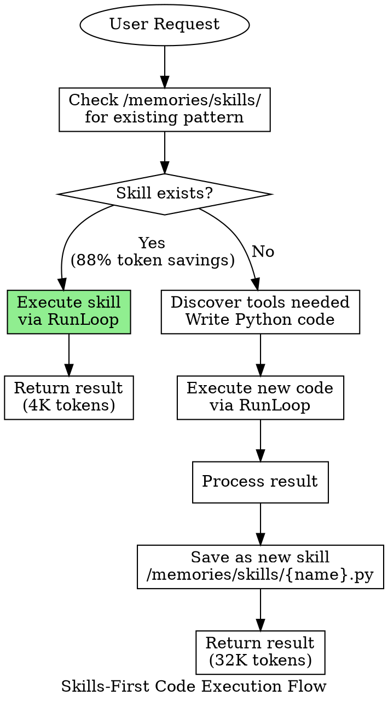
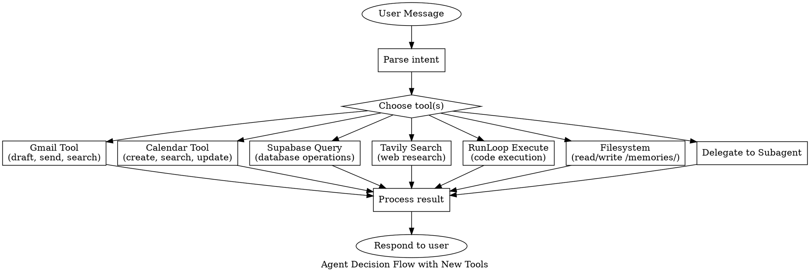

# Corrected Architecture - DeepAgents System

**Purpose**: Architectural overview of corrections based on verification report
**Status**: Planning Phase - No code written yet
**Approval Required**: "Approves, spec"

---

## Executive Summary

This architecture document describes corrections to fix 3 critical blockers and 4 warnings identified in the Master Verification Report:

### Blockers Fixed
1. ❌→✅ **MCP Client Gmail/Calendar**: Replace MCP servers with native LangChain toolkits
2. ❌→✅ **Code Execution**: Replace deprecated PythonREPLTool with RunLoop sandbox
3. ❌→✅ **Missing Badge Component**: Create shadcn/ui Badge component

### Warnings Addressed
4. ⚠️→✅ **Supabase MCP Package**: Correct to `@supabase/mcp-server-postgrest`
5. ⚠️→✅ **Tavily MCP Package**: Correct to `@mcptools/mcp-tavily`
6. ⚠️→✅ **Tool Categorization**: Update patterns for LangChain toolkit tool names
7. ⚠️→✅ **Async/Await Patterns**: Proper async initialization

---

## Architectural Principles

### 1. **Prefer Native LangChain Integrations Over MCP**

**Rationale**: LangChain has mature, well-documented toolkits for Gmail and Calendar. Using these instead of community MCP servers provides:
- Better stability (official LangChain packages)
- Simpler authentication (standard OAuth flow)
- More features (richer API coverage)
- Better error handling
- Active maintenance

**Decision**: Use MCP only when no native LangChain integration exists (Supabase, Tavily)

### 2. **Sandboxed Code Execution for Security**

**Rationale**: Executing arbitrary Python code in the main process is dangerous. RunLoop provides:
- Isolated execution environment (separate devbox)
- Resource limits and timeouts
- Clean execution logs
- API-based control
- Production-ready security

**Decision**: Replace PythonREPLTool with RunLoop sandboxed execution

### 3. **Asynchronous Tool Initialization**

**Rationale**: Modern Python agents run async. Toolkit initialization should be async to:
- Support async tool execution
- Avoid blocking main thread
- Enable concurrent initialization
- Follow LangChain best practices

**Decision**: All toolkit init functions are async

### 4. **Modular Tool Organization**

**Rationale**: Separate concerns for maintainability:
- Tool initialization in dedicated module
- Code execution in separate executor
- Agent orchestration remains clean
- Easy to add new tools

**Decision**: Create `src/tools/` module for all tool management

---

## System Components

### Backend Architecture

```
┌─────────────────────────────────────────────────────────────┐
│                    DeepAgent (legal_agent.py)                │
│  ┌───────────────────────────────────────────────────────┐  │
│  │  System Prompt (Skills-First Workflow)                │  │
│  │  - Check /memories/skills/ for existing patterns       │  │
│  │  - Use RunLoop for code execution                      │  │
│  │  - Save successful workflows as skills                 │  │
│  └───────────────────────────────────────────────────────┘  │
│                            │                                 │
│                            ↓                                 │
│  ┌───────────────────────────────────────────────────────┐  │
│  │  Tools Initialization (toolkits.py)                    │  │
│  │  ┌─────────────────────────────────────────────────┐  │  │
│  │  │  Gmail Toolkit (LangChain Native)               │  │  │
│  │  │  - GmailCreateDraft                              │  │  │
│  │  │  - GmailSendMessage                              │  │  │
│  │  │  - GmailSearch                                   │  │  │
│  │  │  - GmailGetMessage                               │  │  │
│  │  │  - GmailGetThread                                │  │  │
│  │  └─────────────────────────────────────────────────┘  │  │
│  │  ┌─────────────────────────────────────────────────┐  │  │
│  │  │  Calendar Toolkit (LangChain Native)            │  │  │
│  │  │  - CalendarCreateEvent                           │  │  │
│  │  │  - CalendarSearchEvents                          │  │  │
│  │  │  - CalendarUpdateEvent                           │  │  │
│  │  │  - GetCalendarsInfo                              │  │  │
│  │  │  - CalendarMoveEvent                             │  │  │
│  │  │  - CalendarDeleteEvent                           │  │  │
│  │  │  - GetCurrentDatetime                            │  │  │
│  │  └─────────────────────────────────────────────────┘  │  │
│  │  ┌─────────────────────────────────────────────────┐  │  │
│  │  │  Supabase MCP (Corrected Package)               │  │  │
│  │  │  Package: @supabase/mcp-server-postgrest        │  │  │
│  │  └─────────────────────────────────────────────────┘  │  │
│  │  ┌─────────────────────────────────────────────────┐  │  │
│  │  │  Tavily MCP (Corrected Package)                 │  │  │
│  │  │  Package: @mcptools/mcp-tavily                  │  │  │
│  │  └─────────────────────────────────────────────────┘  │  │
│  └───────────────────────────────────────────────────────┘  │
│                            │                                 │
│                            ↓                                 │
│  ┌───────────────────────────────────────────────────────┐  │
│  │  RunLoop Executor (runloop_executor.py)               │  │
│  │  - Create devbox (isolated environment)               │  │
│  │  - Write code to devbox                                │  │
│  │  - Execute with timeout                                │  │
│  │  - Return stdout/stderr                                │  │
│  │  - Clean up devbox                                     │  │
│  └───────────────────────────────────────────────────────┘  │
└─────────────────────────────────────────────────────────────┘
                            │
                            ↓
┌─────────────────────────────────────────────────────────────┐
│              External Services                               │
│  ┌──────────┐  ┌──────────┐  ┌──────────┐  ┌──────────┐   │
│  │  Gmail   │  │ Calendar │  │ Supabase │  │  Tavily  │   │
│  │   API    │  │   API    │  │PostgreSQL│  │  Search  │   │
│  └──────────┘  └──────────┘  └──────────┘  └──────────┘   │
│                     ┌──────────┐                            │
│                     │  RunLoop │                            │
│                     │  Sandbox │                            │
│                     └──────────┘                            │
└─────────────────────────────────────────────────────────────┘
```

### Frontend Architecture

```
┌─────────────────────────────────────────────────────────────┐
│           CodeExecutionBox Component (tsx)                   │
│  ┌───────────────────────────────────────────────────────┐  │
│  │  Props: code, result, status, isSkillExecution        │  │
│  │                                                         │  │
│  │  ┌─────────────────────────────────────────────────┐  │  │
│  │  │  Badge Component (NEW)                          │  │  │
│  │  │  - variant="success" for skill execution        │  │  │
│  │  │  - Shows "🎯 SKILL: {name} (98% tokens saved)"  │  │  │
│  │  └─────────────────────────────────────────────────┘  │  │
│  │                                                         │  │
│  │  ┌─────────────────────────────────────────────────┐  │  │
│  │  │  SyntaxHighlighter (react-syntax-highlighter)   │  │  │
│  │  │  - Display Python code with syntax colors        │  │  │
│  │  └─────────────────────────────────────────────────┘  │  │
│  │                                                         │  │
│  │  ┌─────────────────────────────────────────────────┐  │  │
│  │  │  Status Icon (Lucide React)                     │  │  │
│  │  │  - Loader2, CircleCheckBig, AlertCircle, etc.   │  │  │
│  │  └─────────────────────────────────────────────────┘  │  │
│  └───────────────────────────────────────────────────────┘  │
└─────────────────────────────────────────────────────────────┘

┌─────────────────────────────────────────────────────────────┐
│         toolCategories Utility (ts)                          │
│  ┌───────────────────────────────────────────────────────┐  │
│  │  Tool Name Pattern Matching                           │  │
│  │  1. Built-in tools (exact match)                      │  │
│  │  2. RunLoop code execution (pattern match)            │  │
│  │  3. Gmail toolkit (pattern match)                     │  │
│  │  4. Calendar toolkit (pattern match)                  │  │
│  │  5. Supabase MCP (pattern match)                      │  │
│  │  6. Tavily MCP (pattern match)                        │  │
│  │  7. Fallback to 'other'                               │  │
│  └───────────────────────────────────────────────────────┘  │
└─────────────────────────────────────────────────────────────┘
```

---

## Data Flow

### 1. Tool Initialization Flow



### 2. Code Execution Flow (Skills-First)



### 3. RunLoop Execution Flow

```dot
digraph RunLoopExec {
    label="RunLoop Sandboxed Code Execution";
    rankdir=LR;
    node [shape=box];

    code_request [label="Code to Execute" shape=ellipse];
    create_devbox [label="Create RunLoop Devbox\n(Isolated Environment)"];
    write_code [label="Write code to devbox\nfile system"];
    execute [label="Execute code\nwith timeout"];
    capture [label="Capture stdout/stderr"];
    cleanup [label="Cleanup devbox\n(if configured)"];
    return_result [label="Return result" shape=ellipse];

    code_request -> create_devbox;
    create_devbox -> write_code;
    write_code -> execute;
    execute -> capture;
    capture -> cleanup;
    cleanup -> return_result;
}
```



---

## Control Flow

### Agent Decision Tree



---

## Error Handling Strategy

### 1. Toolkit Initialization Errors

**Gmail/Calendar Toolkit**:
```
Try:
    Read credentials.json
    Initialize toolkit with OAuth flow
    Get tools from toolkit
Except:
    Log warning: "Gmail/Calendar unavailable"
    Return empty list []
    Continue with other tools (graceful degradation)
```

**MCP Servers (Supabase/Tavily)**:
```
Try:
    Check environment variables
    Create MultiServerMCPClient
    Await client.get_tools()
Except:
    Log warning: "MCP server unavailable"
    Return empty list []
    Continue with other tools (graceful degradation)
```

**RunLoop Executor**:
```
Try:
    Create devbox
    Write code
    Execute with timeout
    Get result
Except TimeoutError:
    Log error: "Code execution timeout"
    Return error message to agent
    Agent can retry with simplified code
Except RunLoopError:
    Log error: "RunLoop API error"
    Return error message
    Agent can use alternative approach
```

### 2. Runtime Errors

**Tool Execution Failures**:
- Each tool wrapped in try-except
- Errors logged with context
- Error message returned to agent
- Agent can retry with different parameters
- After 3 failures, agent reports to user

**Code Execution Errors**:
- Syntax errors caught and returned
- Runtime errors captured in stderr
- Agent can see error and fix code
- Timeout prevents infinite loops
- Resource limits prevent memory issues

### 3. Invariants

**Toolkit Initialization**:
- At least Supabase and Tavily must succeed (critical)
- Gmail and Calendar failures are non-fatal (optional)
- RunLoop must be available for code execution (critical)
- Agent can compile with empty tool lists (degrades gracefully)

**Code Execution**:
- All code executes in isolated devbox
- No code executes in main agent process
- Timeouts prevent runaway execution
- Results are always returned (success or error)

---

## External Dependencies

### Python Packages

| Package | Version | Purpose | Critical | Installation |
|---------|---------|---------|----------|--------------|
| `langchain-google-community[gmail,calendar]` | Latest | Gmail/Calendar toolkits | ⚠️ Optional | `pip install langchain-google-community[gmail,calendar]` |
| `runloop-api-client` | Latest | Sandboxed code execution | ✅ Critical | `pip install runloop-api-client` |
| `langchain-mcp-adapters` | >=0.1.0 | MCP client for Supabase/Tavily | ✅ Critical | `pip install langchain-mcp-adapters` |
| `deepagents` | >=0.1.0 | Core agent framework | ✅ Critical | Already installed |
| `langgraph` | >=0.3.0 | Graph execution | ✅ Critical | Already installed |

### Node.js Packages (MCP Servers)

| Package | Purpose | Critical | Testing |
|---------|---------|----------|---------|
| `@supabase/mcp-server-postgrest` | Supabase database operations | ✅ Critical | `npx -y @supabase/mcp-server-postgrest` |
| `@mcptools/mcp-tavily` | Web search | ✅ Critical | `npx -y @mcptools/mcp-tavily` |

### TypeScript/React Packages

| Package | Version | Purpose | Status |
|---------|---------|---------|--------|
| `class-variance-authority` | 0.7.1 | Badge variant styling | ✅ Already installed |
| `react` | 19.1.0 | React framework | ✅ Already installed |

### External Services

| Service | Purpose | Auth | Docs |
|---------|---------|------|------|
| Gmail API | Email operations | OAuth 2.0 (credentials.json) | https://developers.google.com/gmail/api |
| Google Calendar API | Calendar operations | OAuth 2.0 (credentials.json) | https://developers.google.com/calendar/api |
| Supabase PostgreSQL | Database | Service role key | https://supabase.com/docs |
| Tavily API | Web search | API key | https://tavily.com |
| RunLoop API | Code execution | API key | https://runloop.ai/docs |

---

## Testing Strategy

### Unit Tests

**Toolkit Initialization**:
```python
async def test_gmail_toolkit_init():
    # Test with valid credentials
    # Test with missing credentials (graceful degradation)
    # Test tool count and names

async def test_calendar_toolkit_init():
    # Similar to Gmail

async def test_runloop_executor_init():
    # Test with valid API key
    # Test with invalid API key
```

**Code Execution**:
```python
async def test_runloop_execute_simple_code():
    # Test print statement
    # Verify stdout captured

async def test_runloop_execute_with_error():
    # Test code with syntax error
    # Verify stderr captured

async def test_runloop_timeout():
    # Test infinite loop with timeout
    # Verify timeout error returned
```

### Integration Tests

**Agent with New Tools**:
```python
async def test_agent_gmail_draft():
    # User: "Draft email thanking John for coffee"
    # Verify GmailCreateDraft tool called
    # Verify draft created

async def test_agent_calendar_event():
    # User: "Schedule meeting tomorrow at 2pm"
    # Verify CalendarCreateEvent tool called
    # Verify event created

async def test_agent_code_execution():
    # User: "Calculate sum of 1 to 100"
    # Verify RunLoop tool called
    # Verify correct result (5050)
```

### End-to-End Tests

**Skills-First Workflow**:
```python
async def test_skill_creation_and_reuse():
    # First request: Complex data processing
    # Verify RunLoop executes code
    # Verify skill saved to /memories/skills/
    # Second request: Same task
    # Verify skill loaded and executed
    # Verify token savings achieved
```

---

## Migration Plan

### Phase 1: Preparation (Before Implementation)
1. Obtain Gmail credentials.json from Google Cloud Console
2. Obtain Calendar credentials.json from Google Cloud Console
3. Obtain RunLoop API key from runloop.ai
4. Install new Python packages
5. Test MCP packages independently

### Phase 2: Backend Migration
1. Create `src/tools/` module structure
2. Implement `runloop_executor.py`
3. Implement `toolkits.py` with all toolkit initializations
4. Update `legal_agent.py` imports and tool list
5. Update system prompt with RunLoop references
6. Test agent compilation
7. Test each tool individually
8. Test agent with integrated tools

### Phase 3: Frontend Updates
1. Create Badge component
2. Update toolCategories.ts with new patterns
3. Test CodeExecutionBox with Badge
4. Test tool categorization with new tool names

### Phase 4: Validation
1. Run all unit tests
2. Run integration tests
3. Test skills-first workflow end-to-end
4. Verify token savings metrics
5. Test graceful degradation (missing credentials)

### Phase 5: Deployment
1. Update environment variables in deployment
2. Deploy backend with new dependencies
3. Deploy frontend with Badge component
4. Monitor for errors
5. Verify all tools working in production

---

## Documentation URLs (Official Sources)

### LangChain Toolkits
1. **Gmail Toolkit**: https://python.langchain.com/docs/integrations/tools/google_gmail
2. **Calendar Toolkit**: https://python.langchain.com/docs/integrations/tools/google_calendar
3. **Gmail API Reference**: https://python.langchain.com/api_reference/google_community/gmail/langchain_google_community.gmail.toolkit.GmailToolkit.html
4. **Calendar API Reference**: https://python.langchain.com/api_reference/google_community/calendar.html

### RunLoop
5. **RunLoop API Client (Python)**: https://github.com/runloopai/api-client-python
6. **RunLoop Documentation**: https://runloop.ai/docs

### MCP Integration
7. **LangChain MCP**: https://docs.langchain.com/oss/python/langchain/mcp
8. **MCP Adapters GitHub**: https://github.com/langchain-ai/langchain-mcp-adapters

### Google APIs
9. **Gmail API**: https://developers.google.com/gmail/api
10. **Google Calendar API**: https://developers.google.com/calendar/api

---

## Validation Checklist

- [x] All components have defined roles
- [x] Data flow is unidirectional and clear
- [x] Error handling strategy is comprehensive
- [x] External dependencies are documented
- [x] Testing strategy covers all layers
- [x] Migration plan is step-by-step
- [x] Official documentation URLs provided
- [x] Invariants are stated
- [x] Graceful degradation is ensured
- [x] No circular dependencies

---

**Status**: ✅ Architecture Complete - Ready for detailed file plans
**Next Step**: Create per-file .nlplan.md documents
